# Mindlens — Complete Project Documentation

> **Purpose of this file.** This is the single, exhaustive reference for the
> Mindlens final-year project: what it is, why it exists, how every part
> works, what data trained every model, what the measured numbers are, and
> where the honest limits sit. It is written to be handed to another person
> (or another Claude session) who has to write the dissertation/report
> without reading 30,000 lines of source.
>
> **Everything here was verified against the code in this repository**, not
> against the design specs. Where a spec document (`SYSTEM.md`) says one
> thing and the code does another, this file follows the code and says so.
>
> Companion documents: [`SYSTEM.md`](SYSTEM.md) (the architectural contract),
> [`DESIGN.md`](DESIGN.md) (the visual system), [`API.md`](API.md) (the wire
> contract), [`DEPLOYMENT.md`](DEPLOYMENT.md) (the runbook),
> [`../CLAUDE.md`](../CLAUDE.md) (the non-negotiable working rules),
> [`../CHANGELOG.md`](../CHANGELOG.md) (release history + known limitations).

---

## Table of contents

1. [Project identity and the point of it](#1-project-identity-and-the-point-of-it)
2. [Requirements gathering and scope](#2-requirements-gathering-and-scope)
3. [System architecture](#3-system-architecture)
4. [The turn pipeline, end to end](#4-the-turn-pipeline-end-to-end)
5. [The safety gate (Layer 0)](#5-the-safety-gate-layer-0)
6. [The five-model registry](#6-the-five-model-registry)
7. [Datasets](#7-datasets)
8. [Training methodology and measured results](#8-training-methodology-and-measured-results)
9. [The Emotional Operating System (EOS)](#9-the-emotional-operating-system-eos)
10. [The agent system — all fourteen](#10-the-agent-system--all-fourteen)
11. [Response assembly and validation](#11-response-assembly-and-validation)
12. [RAG — retrieval-augmented generation](#12-rag--retrieval-augmented-generation)
13. [The two-layer memory system](#13-the-two-layer-memory-system)
14. [LLM generation layer (Groq)](#14-llm-generation-layer-groq)
15. [Backend API surface](#15-backend-api-surface)
16. [Database design](#16-database-design)
17. [Authentication, authorization, security](#17-authentication-authorization-security)
18. [Privacy: the PII anonymizer](#18-privacy-the-pii-anonymizer)
19. [Frontend architecture](#19-frontend-architecture)
20. [The design system](#20-the-design-system)
21. [Testing strategy](#21-testing-strategy)
22. [Deployment](#22-deployment)
23. [Known limitations — stated plainly](#23-known-limitations--stated-plainly)
24. [Diagram appendix](#24-diagram-appendix)
25. [Repository map](#25-repository-map)

---

## 1. Project identity and the point of it

| Attribute | Value |
|---|---|
| Product | **Mindlens** — a personalised, multi-agent AI wellbeing companion |
| Student | Amiru Umavin Mallawa Arachchi |
| Student number | CL/BSCSD/33/82 · Cardiff no. st20311878 |
| Institution | Cardiff Metropolitan University / ICBT Campus, Colombo, Sri Lanka |
| Programme | BSc (Hons) Software Engineering — Final Year Project |
| GitHub | github.com/AmiruMallawarachchi/mindlens |
| Model host | huggingface.co/AmiruMallawarachchi |
| Version | 0.4.0 (`pyproject.toml`, `main.py`) |
| Backend size | ~11,900 lines of Python |
| Frontend size | ~18,000 lines of TypeScript / TSX |
| Commits | 180 |
| Tests | 730 backend tests collected |

### 1.1 The main point

The thesis of the project is stated in `SYSTEM.md` §1, and it is the sentence
the whole system is built around:

> *"Therapy did not fix me. Therapy gave me the tools to fix myself, over
> and over again for the rest of my life."*

Mindlens is **not** a chatbot that says supportive things. It is an attempt
to build the *tool-giving* half of therapy in software:

1. **Read the feeling underneath the words** — not with a prompted LLM guess,
   but with dedicated, isolated classifiers whose outputs are inspectable.
2. **Remember what matters** — people, hard topics, what has helped before —
   and surface it only when this moment actually needs it.
3. **Hand back a practical next step** — a grounding exercise, a routine, a
   journalling prompt, a track — chosen by state, not by keyword.
4. **Never pretend.** Every claim the interface makes about privacy, safety
   or memory has to be true of the code. In a mental-health product that
   honesty is the only real asset.

### 1.2 What it explicitly is not

Mindlens is not a clinical service, a diagnostic tool, an emergency service,
or a replacement for professional care. The code enforces this rather than
merely saying it:

- `response_validator.py` blocks diagnostic claims and medication advice
  before any text reaches the user.
- The crisis path makes **zero** LLM calls — vetted human-written templates
  only (`crisis_agent.py`).
- The mental-health classifier's output is an internal signal; it is never
  rendered to the user as a label.

### 1.3 Target users

Teens (16–19) and young adults (20–30). Age changes **tone only** — never
safety behaviour. `AgeGroup` is `teen` (`age <= 19`) or `adult` (`age >= 20`),
computed at onboarding and carried on the EOS.

### 1.4 Product voice — "the wise coaching friend"

The tone contract is enforced in `empathy_agent.py` as a hard forbidden-phrase
list, not a style suggestion.

**Banned:** "I understand your feelings" · "That must be hard" · "I hear you" ·
"I understand how you feel" · "As an AI language model" · any diagnosis ·
any medication suggestion.

**Wanted:** the user's name used 2–3 times naturally · one good follow-up
question *before* advice · reference to a real person in their life when
relevant · 3–5 sentences maximum · pure validation with no advice at all when
distress ≥ 0.8.

There is a documented bug-and-fix here worth citing in the report: the prompt
originally handed the model the literal sentence *"music, breathing,
journaling, or just talking — what do you need?"* and instructed it to end
every reply that way. The model complied word for word on every turn,
including to a user who had only said they wanted help. Rule 5 in
`empathy_agent.py` now forbids reciting any menu; structured options are
generated per-turn instead (§10.15).

---

## 2. Requirements gathering and scope

### 2.1 How requirements were derived

Requirements came from four sources, in descending authority:

| Source | What it fixed |
|---|---|
| **Lived-experience thesis** (§1.1) | The product's purpose and voice — tools over comfort |
| **Clinical literature adopted as corpus** | WHO *Doing What Matters in Times of Stress*, NHS self-help material, DBT / ACT / CBT / self-compassion / behavioural-activation practice. These became the 60-entry RAG corpus, each entry carrying a real `source_url` |
| **Safety-first engineering constraints** | A mental-health app cannot fail open. Produced the Layer-0 gate, the zero-LLM crisis path, the response validator, and the PII anonymizer |
| **Approved Claude Design mockups** | Two design projects: *"Mindlens UI Mockups"* (Chat, Chat Mobile, Home) and *"Mindlens System"* (Progress / Journal / Memory / Your Mindlens). The mockups are the source of truth for any screen, not prose specs |

### 2.2 Functional requirements

| # | Requirement | Where it lives |
|---|---|---|
| FR-1 | Register / log in / stay signed in securely | `routers/auth.py`, `middleware/auth.py` |
| FR-2 | Five-step onboarding that seeds long-term memory | `routers/onboarding.py`, `onboarding-flow.tsx` |
| FR-3 | Real-time streaming chat | `routers/chat.py` (WebSocket), `agents/streaming.py` |
| FR-4 | Detect crisis before anything else, on every turn | `agents/safety_gate.py` + orchestrator L2 |
| FR-5 | Classify emotion, mental-health signal and distortion per turn | `models/loader.py`, `orchestrator.process_turn` |
| FR-6 | Ground replies in a curated therapy corpus | `rag/` |
| FR-7 | Route to specialised therapy agents by state | `orchestrator._select_agents` |
| FR-8 | Remember people, topics and coping strategies; show them; let them be deleted | `session_memory_save.py`, `core/memory_recall.py`, `routers/memory.py`, `memory-page.tsx` |
| FR-9 | Show the user what the system actually did this turn | `lib/reasoning.ts`, `pipeline-trace.tsx`, `telemetry` payload |
| FR-10 | Recommend real, playable music | `music_agent.py` (iTunes Search API) |
| FR-11 | Journal with a daily prompt and full CRUD | `routers/journal.py`, `journal-page.tsx` |
| FR-12 | Progress view: mood trend + weekly insight | `routers/dashboard.py`, `progress-page.tsx` |
| FR-13 | Proactive check-ins between sessions | `checkin_scheduler.py`, `checkin_agent.py`, `pending_checkins` |
| FR-14 | Settings that genuinely change behaviour | `components/settings/`, `core/memory_recall.py` |
| FR-15 | Export and hard-delete the account | `routers/account.py` |

### 2.3 Non-functional requirements

| Area | Requirement |
|---|---|
| Latency | Regex scan < 1 ms · crisis classifier < 60 ms · parallel inference < 200 ms · RAG retrieve + rerank < 150 ms · simple full response < 1.5 s |
| Availability | Every external call has a timeout **and** a fallback. No user flow crashes silently |
| Security | JWT in httpOnly cookies, CSRF on cookie-authenticated writes, every Mongo query scoped by `user_id`, rate limits everywhere, secrets from env only |
| Privacy | PII stripped before every model call; delete means a hard delete across every collection |
| Accessibility | Real `aria-label`s, keyboard reachable, visible focus, contrast holds in both grades, `prefers-reduced-motion` respected |
| Observability | Model health (status, latency, error count) exposed on `/ready` and `/api/v1/admin/models`; per-turn degradation reported to the client |

### 2.4 The six non-negotiables

Lifted from `CLAUDE.md`. These are product rules, not preferences, and every
one is enforced in code:

1. **Never ship a control that does nothing.** A setting that saves but is
   never read is the most common bug class in this repo.
2. **Never claim something the code doesn't do** — especially about privacy,
   safety, encryption or memory.
3. **The safety gate runs first on every turn and cannot be bypassed.**
   Crisis responses come from human-written templates with zero LLM calls.
4. **Nothing is remembered without appearing in Memory**, where the user can
   edit or delete it. Delete means a hard delete across every collection.
5. **User-authored text entering a prompt is untrusted.** Fenced, capped, and
   it may shape style — never behaviour.
6. **Every user-scoped database query filters by `user_id`.** Partial updates
   use dotted paths, never `$set` on a whole subdocument.

### 2.5 Explicit scope boundaries

| In scope | Out of scope (this release) |
|---|---|
| Text-only web app | Voice pipeline |
| English | Sinhala / Tamil generation (input is handled without crashing) |
| Five classifiers + Groq generation | Fine-tuning a generation model |
| Two-layer memory | Cross-user / population analytics |
| Health + model-status admin endpoints | A full admin dashboard UI |

---

## 3. System architecture

### 3.1 Technology stack

**Backend**

| Layer | Technology |
|---|---|
| API framework | FastAPI 0.139.2 |
| Runtime | Python 3.11+ |
| Realtime | Native WebSocket (`/ws/chat/{session_id}`) |
| Database | MongoDB Atlas / local MongoDB |
| Async driver | Motor 3.7.1 |
| Auth | PyJWT 2.13 (HS256), bcrypt 5.0 |
| LLM | Groq 1.5.0 |
| Local ML | Transformers 5.15.0 + PyTorch 2.13.0 |
| Vector store | ChromaDB 0.6.3 (embedded, persistent) |
| Embeddings | sentence-transformers 5.6.0 — `all-MiniLM-L6-v2`, 384-dim |
| Config | pydantic-settings 2.14 |
| Testing | pytest + pytest-asyncio (730 tests) |
| Lint / types | Ruff, mypy |

**Frontend**

| Layer | Technology |
|---|---|
| Framework | Next.js 16.3 (App Router, Turbopack) |
| Language | TypeScript 5 |
| UI | React 19.1 |
| Styling | Tailwind CSS 4 over a CSS custom-property token system |
| Motion | `motion` (Framer Motion successor) |
| 3D / gradient | `@react-three/fiber`, `three`, `shadergradient` |
| Components | Radix UI primitives + shadcn-style `ui/` + Vercel AI Elements |
| Realtime | Native `WebSocket` wrapper (`lib/websocket.ts`) |
| Fonts | Instrument Sans (display + UI), Newsreader (emotional voice), Geist Mono (machine truth) |

**External services**

| Service | Purpose | Auth required |
|---|---|---|
| Groq | All therapy-response generation | API key |
| Hugging Face Hub | Hosts all five model repos | Read token |
| Apple iTunes Search API | Real, playable 30-second music previews | **None** |
| MongoDB Atlas | Production persistence | Connection string |
| Vercel | Frontend hosting | — |
| Cloudflare Tunnel | Exposes the local backend (models load in-process) | — |

### 3.2 A note on LangChain / LangGraph

**Mindlens does not use LangChain or LangGraph.** A repository-wide search for
`langchain` / `langgraph` across `backend/`, `requirements.txt`,
`pyproject.toml` and `docs/` returns zero matches. Orchestration is a
**hand-written asyncio pipeline** in `backend/app/agents/orchestrator.py`
(776 lines):

- Parallel model inference via `asyncio.gather`.
- Parallel agent execution via `asyncio.gather(..., return_exceptions=True)`.
- An `AgentRegistry` for discovery by name.
- Explicit imperative routing (`_select_agents`) rather than a declarative
  graph with dynamic edges.

This was a deliberate architectural decision: a fixed, auditable, seven-stage
pipeline in which the safety gate provably runs first is far easier to defend
in a mental-health context than a framework-managed graph. The diagrams in
§24 render that pipeline **in the shape a LangGraph state-graph diagram
takes**, because that is the clearest presentation for a report — but the
runtime is custom asyncio, and the report must not claim otherwise.

### 3.3 The layered architecture

```text
                            ┌───────────────────────────┐
   USER                     │  Next.js 16 (Vercel)      │
     │                      │  /  marketing             │
     ▼                      │  /app  the product        │
  browser                   └───────────┬───────────────┘
                                        │ HTTPS + WSS
                                        ▼
                        ┌───────────────────────────────────┐
                        │  FastAPI (via Cloudflare Tunnel)  │
                        │  CORS → Auth MW → Rate limit →    │
                        │  Request ID → Security headers    │
                        └───────────────┬───────────────────┘
                                        ▼
  ══════════════ LAYER 0 : SAFETY GATE — cannot be bypassed ══════════════
   L1  regex screen, 40+ patterns, < 1 ms, independent of model health
   L2  mindlens-crisis-v3 classifier, threshold 0.45
   either fires ──► CrisisAgent only ──► human-written template ──► END
                                        │ clear
                                        ▼
  ══════════════ LAYER 1 : PARALLEL ML INFERENCE (asyncio.gather) ════════
   emotion (28 classes) · crisis · mental-health (5) · distortion (10)
                                        ▼
  ══════════════ LAYER 2 : EMOTIONAL OPERATING SYSTEM ════════════════════
   surface / core / suppressed emotion · distress · valence · modality
   trust · fatigue · receptiveness · age group · people graph
                                        ▼
  ══════════════ LAYER 3 : MEMORY RECALL (pure, DB-free) ═════════════════
   people graph · trigger topics · effective coping · style preferences
                                        ▼
  ══════════════ LAYER 4 : RAG — skipped on trivial turns ════════════════
   ChromaDB MMR (fetch 20) → cross-encoder rerank → age boost → top 5
                                        ▼
  ══════════════ LAYER 5 : AGENT ORCHESTRATION ═══════════════════════════
   14 agents registered · N selected by EOS · run concurrently
                                        ▼
  ══════════════ LAYER 6 : RESPONSE ASSEMBLY ═════════════════════════════
   priority sort → empathy + at most ONE specialist → validate → stream
                                        ▼
  ══════════════ LAYER 7 : PERSISTENCE ═══════════════════════════════════
   sessions · mood_logs · safety_events · user_memory · pending_checkins
```

### 3.4 Application startup sequence

`backend/app/main.py::lifespan`:

1. `connect_db()` — Motor client, `ping` to fail fast, then create all
   indexes (§16.2).
2. If `PRELOAD_MODELS=true` → `model_manager.warmup_all()` loads all five
   models before accepting traffic.
3. If `PRELOAD_RAG=true` → `ingest_documents()` chunks and embeds the therapy
   corpus; raises if it produces zero chunks.
4. Routers mounted, CORS + auth middleware + security headers installed.
5. `/health` (liveness, touches nothing) and `/ready` (Mongo ping + model
   health + RAG count) become available.

On shutdown: connection manager drains WebSockets, Mongo client closes.

### 3.5 Security headers on every response

`X-Content-Type-Options: nosniff` · `X-Frame-Options: DENY` ·
`Referrer-Policy: no-referrer` ·
`Permissions-Policy: camera=(), microphone=(), geolocation=()` ·
`Cache-Control: no-store` · plus `Strict-Transport-Security` in production.

---

## 4. The turn pipeline, end to end

This is the single most important section for the report. Source:
`backend/app/agents/orchestrator.py::run_full_pipeline`.

### 4.1 The seven steps

```text
run_full_pipeline(user_text, user_name, session_history, user_id, memory, on_stage)
│
├─ 0. begin_degradation_tracking()
│     A ContextVar set for the whole turn. Any agent that falls back to
│     canned text records why. Surfaced to the client as `degraded[]`, so a
│     broken API key during a demo can never look like a working system.
│
├─ 1. process_turn()  ───────────────────────────────────────────────────
│     a. safety_gate.evaluate()  →  L1 regex.  Crisis? return immediately
│        with a hardcoded crisis EOS and agents=["crisis"].
│     b. anonymize(user_text)
│     c. models.predict_all()  →  asyncio.gather over 4 classifiers,
│        return_exceptions=True so one dead model cannot fail the turn.
│        Any empty output records a `model:<name>` degradation.
│     d. Parse: emotion (28 labels), crisis (binary), mental-health (5),
│        distortion (10).
│     e. L2 crisis check: label in {CRISIS, LABEL_1, SUICIDAL_IDEATION,
│        SELF_HARM, HIGH_RISK} AND score > 0.45  →  crisis mode.
│     f. Compute composite distress; determine valence and modality.
│     g. Build the EOS snapshot.
│     h. _select_agents(eos, crisis_flag, substantive)
│     → on_stage("safety", ...) and on_stage("reading", ...)
│
├─ 2. recall_for_turn(memory, ...)  ─────────────────────────────────────
│     Pure function. Merges people graph + style preferences into the EOS.
│     Skipped for crisis: a crisis template must not be restyled by
│     anything the user typed into settings.
│     → on_stage("memory", ...)
│
├─ 3. RAG  ──────────────────────────────────────────────────────────────
│     substantive = turn_is_substantive(user_text, distress)
│     crisis        → chunks=[], status="skipped_crisis"
│     not substantive → chunks=[], status="skipped_trivial"
│     otherwise     → retriever.retrieve(anonymize(text), eos) in a thread
│                     status="ran" | "failed"
│     → on_stage("retrieval", ...)
│
├─ 4. Build AgentContext  ───────────────────────────────────────────────
│     eos, anonymised user_text, user_name, anonymised session_history,
│     rag_chunks, and raw_user_text (local-only, never leaves the process).
│     → on_stage("approach", ...)
│
├─ 5. Run agents  ───────────────────────────────────────────────────────
│     crisis  → CrisisAgent alone, awaited directly.
│     normal  → asyncio.gather(*[agent.run(ctx) for agent in selected],
│                              return_exceptions=True)
│
├─ 6. ResponseAssembler.assemble(outputs, in_crisis, user_name)
│     Priority sort → empathy + at most one specialist → dedup → validate.
│
├─ 6b. build_options(assembled_text, user_text)  — non-crisis only
│      Turns a follow-up question into 2–4 tappable answers.
│
└─ 7. Return the turn payload (eos, agents, crisis_flag, assembled_text,
      agent_outputs, safety, degraded, memory_recalled, options, telemetry)
```

### 4.2 The `substantive` gate — why it exists

```python
_SUBSTANTIVE_WORD_COUNT = 4

def turn_is_substantive(user_text: str, distress_level: float) -> bool:
    if distress_level >= 0.5:
        return True
    return len(user_text.split()) >= _SUBSTANTIVE_WORD_COUNT
```

`held_back = opening_turn or not substantive`, where
`opening_turn = (session_turn_count == 0 and distress_level < 0.7)`.

Both gates exist because the pipeline used to answer *"hi"* with a grounding
exercise, a CBT challenge and a music track simultaneously.

**Distress overriding word count is deliberate and load-bearing.**
*"i cant anymore"* is three words and is the most important turn in the
conversation. Length must never be what silences the pipeline.

### 4.3 Composite distress

`Orchestrator._compute_distress`:

```
distress = 0.40 × max(emotion_score[e] × severity_weight[e] for e in NEGATIVE)
         + 0.25 × max(mental_health_scores)
         + 0.35 × crisis_score
```

Severity weights (`core/emotion_labels.py`), highest first:
grief 1.00 · fear 0.95 · sadness 0.90 · anger 0.85 · remorse 0.85 ·
disgust 0.80 · disappointment 0.75 · nervousness 0.70 · embarrassment 0.65 ·
annoyance 0.50 · confusion 0.45 · disapproval 0.40. Positive emotions
contribute 0.0.

### 4.4 Emotion derivation

| Field | Rule |
|---|---|
| `surface_emotion` | argmax over all 28 class scores |
| `surface_confidence` | the classifier's **actual** score for that label, rounded to 3 dp |
| `core_emotion` | highest-scoring **negative** emotion; falls back to overall argmax |
| `suppressed_emotion` | second-highest emotion overall |
| `valence` | negative if core is in `NEGATIVE_EMOTIONS`, positive if in `POSITIVE_EMOTIONS`, else neutral |
| `modality` | `CBT` by default; `DBT` when distress > 0.7 |

A documented and fixed bug worth citing: `surface_confidence` was never
assigned, so every turn kept the field's `0.8` default — and that constant
was shown to the user as *"how confident the emotion model is in this read"*,
narrated in the thinking panel, fed to the empathy prompt, and used to scale
the room's colour intensity. A fabricated number presented as a measurement,
on the one figure the product uses to justify *"a read, never a diagnosis"*.

### 4.5 Live stage callbacks

`on_stage(stage_id, human_summary)` is awaited at each real stage boundary and
pushed to the client as a `stage_update` frame. The four stages are
`safety`, `reading`, `memory`, `retrieval`, `approach`. This exists because
`run_full_pipeline` runs to completion before anything streams, so the client
previously received all four trail sections at once, already finished — there
was no "one by one" to watch. The progression a user sees is now the real one.

Example strings actually emitted:

- safety: *"Both layers clear."* / *"Crisis signals found — everything else pauses."*
- reading: *"Reading nervousness at 0.62 confidence."*
- memory: *"Recalled 2 things from before."* / *"Nothing on file matched this turn."*
- retrieval: *"Pulled 5 passages from the therapy notes."* /
  *"No lookup needed for this one."* / *"Skipped — safety comes first."*
- approach: *"Working through it with empathy, mindfulness."*

### 4.6 The `telemetry` payload

Sent on both `thinking_update` and `response` so the UI can describe the turn
truthfully rather than reciting a script:

```jsonc
"telemetry": {
  "rag": {
    "status": "ran",          // ran | skipped_trivial | skipped_crisis | failed | provided
    "chunks": 5,
    "model": "mindlens-rag-reranker"   // null unless the reranker was configured to run
  },
  "modality": "CBT",          // null unless a modality-driven agent actually ran
  "substantive": true
}
```

`modality` is null unless one of `{distortion, challenge, reflection}` ran.
Every turn carries a modality field internally, but naming one on a turn where
no modality-driven agent ran would describe a decision that had no effect.

---

## 5. The safety gate (Layer 0)

Source: `backend/app/agents/safety_gate.py`, plus the L2 check inside
`orchestrator.process_turn`.

### 5.1 Two layers, not three

| Layer | Method | Where | Target latency |
|---|---|---|---|
| **L1** | Regex crisis pattern scan | `SafetyGate.evaluate()` | < 1 ms |
| **L2** | `mindlens-crisis-v3` classifier, fires above 0.45 | orchestrator, after L1 clears | < 60 ms |

Either trigger means crisis mode. L1 is deliberately first and **independent
of model health**: if the classifier is down, unloaded, or returns nothing,
the regex screen still runs and still catches. A turn where the classifier
was unavailable is recorded as `model:crisis` degraded and logged at ERROR —
never allowed to pass silently.

**There is no semantic-search third layer.** An earlier design called for
embedding search against a crisis corpus. It was never built, and `SYSTEM.md`
previously described it as if it existed. It has been removed from the docs.
Adding it would improve recall on paraphrased crisis language that neither
the patterns nor the classifier catch — that is the honest gap and it is
future work.

### 5.2 The L1 pattern set

Approximately 45 compiled case-insensitive patterns in five families:

| Family | Examples |
|---|---|
| **Direct self-harm / suicide** | `\bkill\s+(myself\|me)\b`, `\bsuicid`, `\bend\s+(my\s+)?life\b`, `\bwant\s+to\s+die\b`, `\bbetter\s+off\s+dead\b`, `\bcut\s+(myself\|my\s+wrists?)\b`, `\bhang\s+myself\b`, `\boverdose\b`, `\bcan't\s+go\s+on\b` |
| **Harm to others** | `\bkill\s+(someone\|him\|her\|them)\b`, `\bstab\s+(someone\|…\|myself)\b`, `\bshoot\s+(someone\|…\|up\s+the)\b` |
| **Hopelessness / worthlessness** | `\bhopeless\b`, `\bworthless\b`, `\b(i'm\|i\s+am\|am\s+i)\s+(such\s+)?a\s+burden\b`, `\beveryone\s+would\s+be\s+better\s+off\b`, `\bunlovable\b` |
| **Coded / indirect** | `\b(bye\|goodbye\|see\s+you)\s+(forever\|soon)\b`, `\b(final\|last)\s+message\b`, `\bstop\s+the\s+pain\b`, `\bbroken\s+beyond\s+repair\b` |
| **Methods** | `\bnoose\b`, `\bend\s+of\s+my\s+rope\b`, `\b(train\|bridge\|cliff\|roof\|building)\b.*\b(jump\|fall)\b`, `\b(jump\|throw\s+myself)\s+(off\|in\s+front\s+of)\b` |

Three precision decisions are documented in the source and are worth citing:

1. **Harm-to-others verbs require an object.** A bare verb is ordinary
   English: *"I beat my personal best"*, *"shoot, I forgot"*, *"a stabbing
   pain"*.
2. **"Burden" is first-person only.** *"the financial burden on my family"*
   is not a risk indicator; *"I'm a burden to my family"* is.
3. **Method patterns are order-independent.** The original only matched
   noun-before-verb, so *"jump off the bridge"* — the more natural phrasing —
   missed entirely.

### 5.3 Unicode normalisation — a real recall fix

```python
@staticmethod
def _normalize(user_message: str) -> str:
    return (user_message.replace("’", "'")   # right single quote
            .replace("‘", "'")               # left single quote
            .replace("ʼ", "'")               # modifier letter apostrophe
            .replace("“", '"').replace("”", '"'))
```

Every pattern is written with a straight apostrophe. Phones and word
processors substitute typographic apostrophes automatically, so a message
typed on any mobile keyboard arrives as *"I can't do this anymore"* with a
curly apostrophe and sailed past L1 entirely without this fold. This is a
crisis-recall fix, not cosmetics.

### 5.4 Crisis mode behaviour

When either layer fires:

| Rule | Enforcement |
|---|---|
| Do not call Groq | `crisis_flag` short-circuits `_select_agents` to `["crisis"]`; `CrisisAgent` has `llm_tier="none"`, `max_tokens=0` |
| Do not run empathy / mindfulness / music / challenge | Same |
| Do not retrieve RAG | `rag_status = "skipped_crisis"`, chunks = `[]` |
| Do not apply user style preferences | `recall_for_turn` results are not merged into the EOS in crisis |
| Use approved templates only | `CRISIS_TEMPLATES["moderate" \| "severe"]`, selected at distress ≥ 0.85 |
| Include Sri Lankan emergency resources | `CRISIS_RESOURCES` list + `CRISIS_RESOURCES` text block |
| Log the safety event | `_save_safety_event` writes to `safety_events` |

### 5.5 Crisis resources (structured, rendered as contact rows)

```python
CRISIS_RESOURCES = [
    {"name": "Sri Lanka — Sumithrayo",            "number": "011 269 6666"},
    {"name": "National Mental Health Helpline",   "number": "1926"},
    {"name": "Emergency services",                "number": "119 / 110"},
]
```

The crisis path is the **only** place the disclaimer/resources stay inline in
the reply. Everywhere else the disclaimer is UI chrome, because in a crisis
the helpline numbers *are* the message.

### 5.6 The crisis classifier's three-version history

This is one of the strongest evidence sections available for the report,
because it demonstrates a real train/serve mismatch, a failed intermediate
fix, and a measured resolution.

**v1 — `mindlens-crisis` (shipped, then found broken in production)**

| Message | Score | Verdict |
|---|---|---|
| "I want to kill myself" | 0.88 | crisis, correct |
| "It is mostly that I am scared it will not be good enough." | 0.82 | **false positive** |
| "so i need a help okay" | 0.72 | **false positive** |
| "There is no point in living" | 0.59 | crisis, correct |
| "I have been really anxious about my final year project." | 0.03 | safe, correct |

On a 15-benign / 6-crisis probe set at threshold 0.45: **6/6 crisis caught,
2/15 benign flagged.** No threshold fixed it — at 0.85 the false positives
vanished but only 4/6 real crisis messages were caught, *"There is no point in
living"* among the missed. Separation margin: **+0.06**.

**Root cause — train/serve mismatch in three parts:**

1. **Composition.** The `safe` class was Reddit meme chatter; the `crisis`
   class was long, sincere, distressed posts. The model never saw text that
   was emotionally serious and *not* a crisis, so it learned *"heartfelt
   equals crisis"*.
2. **Preprocessing.** The upstream corpus was lemmatised and
   stopword-stripped (*"not see point anymore"*). Nothing in the serving path
   preprocesses anything — `predict_all` passes raw user text straight
   through. The model was reading a different language than it was taught.
3. **Length.** Training posts had a median of 30 words; real chat messages
   run four to fifteen.

**Aggregate F1 concealed all three**, because the test split was drawn from
the same distribution as the training data. This is the single most citable
methodological finding in the project.

**v2 — `mindlens-crisis-v2` (never promoted)**

Fixed length and composition for the `safe` class only: added short, clean
synthetic examples there, left `crisis` untouched (median 69 words, and even
the short rows were Reddit title+selftext glued together with no space, e.g.
*"Im outFuck this shit im done, good bye"*). It learned *"short and clean ==
not crisis"* regardless of content: scored *"I want to kill myself"* at
**0.367** and missed **5/5** blunt crisis probes. Caught by the probe check
before deployment and never shipped.

**v3 — `mindlens-crisis-v3` (deployed today)**

Adds the mirror synthetic set on the crisis side: 40 short, direct,
first-person crisis sentences, upsampled 40×, the same treatment the safe
side got — so both classes span the same register.

| Message | Score | Verdict |
|---|---|---|
| "I want to kill myself" | **0.999** | crisis, correct |
| "It is mostly that I am scared it will not be good enough." | **< 0.001** | safe, correct |
| "so i need a help okay" | **< 0.001** | safe, correct |

Probe set (6 safe / 5 crisis): **0/6 false positives, 5/5 crisis caught at
every threshold from 0.45 to 0.9.** Separation margin **+0.998** (v1: +0.06;
v2: never separated).

**Not claimed:** generalisation beyond the probe set and the training
distribution it was built from. These probes are the specific production
failures this retrain answers, not a held-out benchmark of open-ended crisis
language. Saying so is part of the deliverable.

### 5.7 Why the threshold stays at 0.45

With v1's thin margin, 0.45 was a deliberate lean toward interrupting a
conversation that didn't need it rather than missing one that did. With v3's
wide margin the threshold choice matters far less — but there was no reason
to move it, and `SYSTEM.md` §8.3 requires a student-approved safety review
before it is ever raised. The system prioritises recall.

### 5.8 Model versioning discipline

`scripts/build_crisis_dataset.py` builds the corpus;
`scripts/train_crisis_model.py` trains and publishes it. **Each version goes
to its own Hugging Face repo** so a bad checkpoint can never overwrite the
live classifier before its probes are checked. The training script prints a
threshold sweep and a separation margin, and prints
`*** MARGIN NOT POSITIVE — do not ship this checkpoint. ***` if the margin
fails. This is what caught v2.

---

## 6. The five-model registry

Source: `backend/app/models/loader.py`, `backend/app/config.py`.

### 6.1 The registry at a glance

| # | Pipeline name | Model ID | Origin | Base | Params | Task |
|---|---|---|---|---|---|---|
| 1 | `emotion` | `SamLowe/roberta-base-go_emotions` | **Adopted — public checkpoint, not trained here** | roberta-base | ~125 M | 28-class multi-label emotion |
| 2 | `mental_health` | `AmiruMallawarachchi/mindlens-mh-classifier` | **Fine-tuned for Mindlens** | `mental/mental-bert-base-uncased` | ~110 M | 5-label multi-label MH signal |
| 3 | `crisis` | `AmiruMallawarachchi/mindlens-crisis-v3` | **Fine-tuned for Mindlens** | `distilbert-base-uncased` | ~67 M | Binary crisis detection |
| 4 | `rag_reranker` | `AmiruMallawarachchi/mindlens-rag-reranker` | **Fine-tuned for Mindlens** | `cross-encoder/ms-marco-MiniLM-L-6-v2` | ~22.7 M | Cross-encoder relevance (num_labels=1) |
| 5 | `distortion` | `AmiruMallawarachchi/mindlens-distortion-classifier` | **Fine-tuned for Mindlens** | `roberta-base` | ~125 M | 10-class multi-label CBT distortion |

### 6.2 Why one is adopted and four were trained — the actual reasoning

This is exactly the question the report needs answered, and the answer is
in the code and the changelog rather than in a claim.

**Why the emotion classifier is adopted:**

- GoEmotions (58 k Reddit comments, 28 classes, multi-label) is a large,
  well-benchmarked public dataset, and `SamLowe/roberta-base-go_emotions` is
  a strong, widely-used public checkpoint trained on exactly it. There was
  no domain-specific gap that justified spending the project's limited GPU
  budget re-deriving a result that already existed at higher quality.
- Emotion classification is the one task in the five where the public
  training distribution (informal, emotionally expressive Reddit comments)
  genuinely resembles the input the product receives (people typing feelings
  into a chat box). The other four tasks had no such match.
- It is **marked as adopted in the product itself.** The home page's Models
  band carries an `adopted, not ours` badge on that one card and the
  section header reads *"Four fine-tuned for Mindlens. One adopted — the
  emotion classifier is a public GoEmotions checkpoint, marked below."*
  Saying so is the difference between "five models" and "five models I
  trained".

**Why the other four had to be trained:**

| Model | Why no public checkpoint would do |
|---|---|
| **Crisis** | The threshold, the class boundary and the failure direction are all product-safety decisions. An off-the-shelf suicide-detection model would have been a black box with an unknown false-negative profile, and §5.6 shows this task is dominated by train/serve mismatch that only a purpose-built corpus can fix |
| **Mental health** | Needed a specific 5-label taxonomy (depression, anxiety, stress, burnout, PTSD) matched to the EOS's distress computation. Starting from MentalBERT — a BERT pre-trained on mental-health corpora — was the domain-alignment step |
| **RAG reranker** | Relevance is domain-specific. `ms-marco-MiniLM` is trained on web search; ranking counselling passages against a distressed message is a different judgement. Fine-tuning on real counsellor Q&A is the whole contribution |
| **Distortion** | 10-class CBT distortion labelling has no usable public dataset at all. This is why it is also the weakest of the five (§8.5) — an honest, documented result rather than a hidden one |

**The strongest evidence that the adopted model is the weak link:** now that
real confidence scores are surfaced, spot checks show clearly negative
messages landing on the wrong label —

- *"so anxious about my exam next week"* → **excitement** (0.57)
- *"my sister and I had a huge fight and I feel awful"* → **disgust** (0.47)

It was trained on Reddit comments, not on people describing distress. This is
the strongest argument for finishing the in-house 28-class multi-label
trainer that exists in `training/emotion-classifier-multilabel.ipynb` (§8.6),
and it belongs in the report's evaluation chapter.

### 6.3 Lazy loading, health metadata, and the load lock

`ModelManager` is a process-wide singleton with three notable engineering
decisions:

**1. A `threading.Lock`, not an `asyncio.Lock`.**
`_load_pipeline` runs inside `asyncio.to_thread`, so callers for different
models are genuinely concurrent OS threads, not coroutines on one event loop
— an `asyncio.Lock` would not coordinate across them. Before the lock was
acquired anywhere, the first real turn after startup fired four model loads
across four threads simultaneously, each building a multi-hundred-MB torch
model under shared memory pressure. Live-observed failure:
`Cannot copy out of meta tensor; no data!`. The lock serialises the
*loading* phase only; inference on already-loaded models stays fully
concurrent.

**2. Per-model Hub revision pinning.**

```python
emotion_model_revision   = "d75048347613a25d77de8cf6412eaae9fa7b26be"  # exact commit
crisis_model_revision    = "main"
mh_model_revision        = "main"
distortion_model_revision = "main"
rag_reranker_model_revision = "main"
```

Without `revision`, `from_pretrained` takes whatever sits at the branch head
at download time — so a re-pushed or compromised repo silently swaps the
weights the app runs on (the supply-chain hole `bandit` flags as B615). The
third-party emotion checkpoint is pinned to an exact commit because that is
where the actual exposure is. The four in-house repos track `main` because
they are still being retrained and a stale pin would quietly keep serving a
superseded model. **These must be pinned before anything that needs
reproducible inference — a dissertation result, or a release.**

**3. A tokenizer fix for the crisis model.**
Its HF repo pairs a `BertTokenizerFast` (which emits `token_type_ids` by
default) with a `DistilBertForSequenceClassification` model (which has no
segment embeddings and rejects that kwarg outright). Every real call raised,
the exception was swallowed by `predict_all`'s `return_exceptions=True`, and
the classifier layer of crisis detection was **silently zeroed out on every
single turn**. Fixed by restricting the tokenizer's output keys at
construction:

```python
tokenizer_model_input_names=["input_ids", "attention_mask"]
```

### 6.4 Health status contract

`model_manager.health_status()` returns, per model:

```jsonc
{
  "status": "ready" | "loading" | "error" | "not_loaded",
  "model_id": "AmiruMallawarachchi/mindlens-crisis-v3",
  "loaded_at": "2026-08-18T09:14:22.104Z",
  "last_inference_ms": 41.7,
  "error": null,
  "error_count": 0
}
```

`error_count` is a running counter, merged rather than overwritten. Before
that, each failure replaced the previous health entry outright, so a model
that failed 50 times looked identical to one that failed once.

Exposed at `GET /ready` and `GET /api/v1/admin/models`.

### 6.5 Inference execution

- Device: CUDA if available, else CPU. dtype float16 on GPU, float32 on CPU.
- `truncation=True, max_length=512` on every pipeline.
- `top_k=None` (all scores) for emotion, mental-health, distortion;
  `top_k=1` for crisis and the reranker.
- Per-call timeout: `MODEL_INFERENCE_TIMEOUT_SECONDS` (default 30 s).
- `predict_all` runs four classifiers with `asyncio.gather(...,
  return_exceptions=True)`; a failure maps to `[]` and records a degradation.
- The reranker's `rerank()` is **synchronous on purpose**: its only caller
  already runs in a worker thread, and the whole candidate set goes through
  in one batched call rather than one call per chunk.

---

## 7. Datasets

Source: `notebooks/00_Master_Summary.ipynb` (the dataset inventory),
`notebooks/01–08_*.ipynb` (per-dataset cleaning),
`data/reports/*.json` (machine-generated cleaning reports),
`scripts/build_crisis_dataset.py` (the v3 crisis rebuild).

### 7.1 The eight source datasets

| # | Dataset | Hugging Face ID | Used by | Raw | Cleaned | Retention | Task | Main cleaning fix |
|---|---|---|---|---:|---:|---:|---|---|
| 1 | **GoEmotions** | `google-research-datasets/go_emotions` | Model 1 (emotion) | 58,009 | 54,263 | 93.5 % | 28-class multi-label emotion | Class weights for the 172× imbalance |
| 2 | **DAIR-AI Emotion** | `dair-ai/emotion` | Model 1 (emotion) | 20,000 | 19,612 | 98.1 % | 6-class emotion (Twitter) | Hashtag normalisation, emoji preserved |
| 3 | **Suicide Prediction** | `vibhorag101/suicide_prediction_dataset_phr` | Model 3 (crisis) | 232,000 | 185,000 | 79.7 % | Binary crisis detection | Threshold set at 0.45 for recall |
| 4 | **DepSeverity** | `bdotloh/DepSeverity` | Model 3 (crisis, hard negatives) | 3,553 | 3,201 | 90.1 % | Severity 0.0–1.0 | PHQ-9 labels mapped to a float |
| 5 | **Reddit MH Posts** | `solomonk/reddit_mental_health_posts` | Model 2 (mental health) | 151,000 | 62,000 | 41.1 % | Multi-label MH condition | Subreddit → multi-label via keywords |
| 6 | **MH Text Classification** | `ourafla/Mental-Health_Text-Classification_Dataset` | Model 2 (mental health) | 48,945 | 43,500 | 88.9 % | Multi-label MH (4-class mapped) | 4-class → 5-condition mapping |
| 7 | **CounselChat** | `nbertagnolli/counsel-chat` | Models 4 (distortion) + 5 (reranker) | 930 questions / 2,775 Q-A rows | 847 / 2,612 | 91.1 % / 94.1 % | Distortion labels + therapy pairs | Auto-labelled 10 distortions |
| 8 | **EmpatheticDialogues** | `facebook/empathetic_dialogues` | Model 5 support | 25,000 | 10,000 | 40.0 % | Empathic instruction pairs | Sampled 10 k (seed 42), 12:1 ratio |

**Totals:** 539,437 raw examples → 377,423 cleaned (≈ 70 % overall retention).

*(Row 7 shows two numbers because the cleaning notebook deduplicates to
unique questions (930 → 847) while the reranker notebook consumes every
question–answer row (2,775 → 2,612). Both figures are real; the report should
name which one it is quoting.)*

### 7.2 Cleaned-dataset artefacts

Cleaned datasets are saved as Arrow `DatasetDict`s under `data/cleaned/` and
pushed to the Hub so an examiner can verify the preprocessing independently:

| Notebook | Hub dataset repo |
|---|---|
| 01 | `AmiruMallawarachchi/mindlens-go-emotions-cleaned` |
| 02 | `AmiruMallawarachchi/mindlens-dair-emotion-cleaned` |
| 03 | `AmiruMallawarachchi/mindlens-crisis-cleaned` |
| 04 | `AmiruMallawarachchi/mindlens-dep-severity-cleaned` |
| 05 | `AmiruMallawarachchi/mindlens-reddit-mh-cleaned` |
| 06 | `AmiruMallawarachchi/mindlens-ourafla-mh-cleaned` |
| 07 | `AmiruMallawarachchi/mindlens-mh-classifier-data` |
| 08 | `AmiruMallawarachchi/mindlens-model5-training-data` |
| crisis rebuild | `AmiruMallawarachchi/mindlens-crisis-cleaned-v3` |

### 7.3 Measured cleaning statistics

**GoEmotions** (`data/reports/go_emotions_cleaned_report.json`):

| Split | Original | Cleaned | Skipped (too short) | Duplicates removed | Retention |
|---|---:|---:|---:|---:|---:|
| train | 43,410 | 40,168 | 3,202 | 40 | 92.5 % |
| validation | 5,426 | 5,025 | 399 | 2 | 92.6 % |
| test | 5,427 | 5,034 | 393 | 0 | 92.8 % |

- **Imbalance ratio: 172.17×.** Class weights computed and saved (28 weights,
  from 0.131 for `neutral` to 22.63 for the rarest class).
- Most common labels: `neutral` (12,913), `admiration` (3,735),
  `approval` (2,792).
- Least common: label 16 `grief` (75), label 21 `pride` (102),
  label 23 `relief` (150).

**DAIR-AI Emotion** (`data/reports/dair_emotion_cleaned_report.json`):

| Split | Original | Cleaned | Skipped | Retention |
|---|---:|---:|---:|---:|
| train | 16,000 | 15,992 | 8 | 100.0 % |
| validation | 2,000 | 1,999 | 1 | 100.0 % |
| test | 2,000 | 2,000 | 0 | 100.0 % |

- **Imbalance ratio: 9.37×.** Six class weights: [0.571, 0.497, 2.044, 1.236,
  1.377, 4.660] for sadness / joy / love / anger / fear / surprise.

### 7.4 Why each dataset was chosen

Quoted from the cleaning notebooks, because the justification matters more
than the row counts:

- **GoEmotions:** *"Reddit comments are informal, emotionally expressive, and
  written in the same style users will type to MindLens. Formal text datasets
  (news articles, academic papers) would produce a model that fails on
  conversational emotional language."*
- **DAIR-AI Emotion:** *"GoEmotions has 27 nuanced emotion classes from
  Reddit (longer, complex text). DAIR-AI has 6 clear basic emotions from
  Twitter (shorter, punchy text). Training on both makes Model 1 robust to
  both short emotional outbursts ('I'm terrified') and longer emotional
  narratives."*
- **Suicide Prediction (`vibhorag101`):** MIT-licensed, freely downloadable,
  no approval gate — a deliberate constraint for a student project that has
  to be reproducible by an examiner.
- **CounselChat:** real counsellor answers to real questions, which is the
  only realistic ground truth available for both distortion labelling and
  passage relevance.

### 7.5 The crisis v3 corpus rebuild (`scripts/build_crisis_dataset.py`)

This script is the project's most substantial data-engineering contribution.
It rebuilds the crisis training set to match what the product actually
receives.

**Base source:** `Ram07/Detection-for-Suicide` — chosen over the originally
used corpus specifically because it retains the **raw `text` column**. The
dataset the shipped v1 model used kept only the lemmatised version, which is
mismatch #2 from §5.6.

**Normalisation is whitespace and Unicode only.** No lemmatising, no
stopword removal — that mismatch is half of what the rebuild exists to fix.
Rows are kept at 3–300 words.

**Hard-negative pools** — emotionally serious text that is explicitly *not*
a crisis, which is the class the shipped model never saw:

| Pool | Source | Why |
|---|---|---|
| `dep_severity` | rows with `crisis_label == 0` | Someone else already made the crisis judgement — the safest source |
| `dair_emotion` | all rows | Short emotional utterances; fixes the length mismatch as well as the composition one |
| `reddit_mh_posts` | all rows | Genuine anxiety / PTSD / depression without suicidality |
| `ourafla_mh` | all rows | Same |
| `counselchat` | question text | Serious, help-seeking, not crisis — the exact register of *"so i need a help okay"* |
| `synthetic_short` | 40 hand-written sentences | Product-shaped four-to-fifteen-word turns |

**The regex filter.** *Every* candidate safe negative is passed through the
**production safety-gate regex** first, and anything it flags is dropped
rather than labelled safe:

```python
sys.path.insert(0, str(ROOT / "backend"))
from app.agents.safety_gate import safety_gate   # the live patterns, imported
```

Importing the production regex means the filter here and the L1 gate at
runtime **can never drift apart**. Mislabelling a real crisis as safe is the
one error this system must not learn to make, so when a negative is doubtful
it is discarded, not kept. `SYNTHETIC_CRISIS` rows skip that filter — being
flagged by the regex is expected and fine for a row already labelled crisis.

**Synthetic sets.** 40 safe + 40 crisis short, direct, first-person
sentences, each upsampled **40×**. Both observed production false positives
(*"so i need a help okay"*, *"It is mostly that I am scared it will not be
good enough."*) and all three crisis probes are in the data **by name** —
they are the bug this rebuild answers, so they belong in the corpus. The rest
cover the phrasings around them (blunt, planning, indirect *"no point left"*)
so the model learns the register rather than memorising three strings.

**Final composition rule:**

```
n_crisis = |crisis rows including synthetic|
n_hard   = min(|hard negatives|, 0.55 × n_crisis)
n_base   = min(n_crisis − n_hard, |original safe|)
safe     = hard[:n_hard] + base_safe[:n_base] + synthetic_safe × 40
```

The meme-heavy original safe class is deliberately **capped** so hard
negatives are not drowned out — that imbalance is what taught v1 *"serious
equals crisis"* in the first place.

**Splits:** 80 / 10 / 10, seed `20260817`. The script prints per-split label
counts and **median word count per class**, which is the specific statistic
that exposed the v2 failure.

---

## 8. Training methodology and measured results

Training ran on Kaggle (T4 ×2 and P100) notebooks under `training/`, with
`scripts/train_*.py` as the runnable script equivalents. All checkpoints
publish to Hugging Face.

### 8.1 Model 2 — Mental-Health Classifier (measured, published)

| Field | Value |
|---|---|
| Repo | `AmiruMallawarachchi/mindlens-mh-classifier` |
| Base model | `mental/mental-bert-base-uncased` |
| Dataset | `AmiruMallawarachchi/mindlens-ourafla-mh-cleaned` |
| Task | 5-label multi-label classification |
| Labels | `LABEL_0` depression · `LABEL_1` anxiety · `LABEL_2` stress · `LABEL_3` burnout · `LABEL_4` ptsd |
| Loss | `BCEWithLogitsLoss` |
| Notebook | `training/mh-classifier-training.ipynb` |

**Measured results (from the notebook's saved output):**

| Metric | Score | Target |
|---|---:|---:|
| **F1 macro** | **0.8151** | > 0.70 ✅ |
| **F1 micro** | **0.8185** | — |
| **Average AUC** | **0.9383** | — |

This comfortably exceeds `SYSTEM.md` §19.3's 80 % acceptance bar and is the
strongest headline number in the project.

**Product rule:** this output is **never** shown to the user as a diagnosis.
It is an internal signal that raises `distress_level` (25 % of the composite)
and feeds progress tracking.

### 8.2 Model 3 — Crisis Classifier (measured, published, v3)

| Field | Value |
|---|---|
| Repo | `AmiruMallawarachchi/mindlens-crisis-v3` |
| Base model | `distilbert-base-uncased` (~67 M params) |
| Dataset | `AmiruMallawarachchi/mindlens-crisis-cleaned-v3` |
| Task | Binary sequence classification |
| Threshold in production | **0.45** |

**Hyperparameters** (`scripts/train_crisis_model.py`):

| Parameter | Value |
|---|---|
| Learning rate | 3e-5 |
| Train batch size | 16 |
| Gradient accumulation | 2 (effective 32) |
| Eval batch size | 32 |
| Epochs | 3 |
| Weight decay | 0.01 |
| Max length | 256 tokens |
| `metric_for_best_model` | **`recall`** (not F1 — deliberate) |
| Early stopping | patience 2 |
| Mixed precision | fp16 |
| Seed | 42 |

Selecting the best checkpoint by **recall** rather than F1 is a safety
decision: a false negative in this model is categorically worse than a false
positive.

**Acceptance is by probe set, not by aggregate metric.** The training script
prints every probe score, a threshold sweep from 0.45 to 0.9, and a
separation margin, then refuses to endorse a checkpoint whose margin is not
positive. §5.6 carries the full three-version measurement table.

| Version | "I want to kill myself" | Benign FP rate @ 0.45 | Crisis caught @ 0.45 | Margin | Shipped? |
|---|---:|---:|---:|---:|---|
| v1 | 0.88 | 2/15 | 6/6 | +0.06 | shipped, then replaced |
| v2 | 0.367 | — | 0/5 | never separated | **rejected by probes** |
| v3 | **0.999** | **0/6** | **5/5** | **+0.998** | **live** |

### 8.3 Model 5 — RAG Reranker (published; methodology fully documented)

| Field | Value |
|---|---|
| Repo | `AmiruMallawarachchi/mindlens-rag-reranker` |
| Base model | `cross-encoder/ms-marco-MiniLM-L-6-v2` (~22.7 M params, pre-trained on MS MARCO passage ranking) |
| Architecture | Cross-encoder, `num_labels=1`, sigmoid activation — the score *is* the relevance |
| Source data | `nbertagnolli/counsel-chat` — 2,775 rows → 2,612 after cleaning, 30 topics |
| Notebook | `training/model-rag-reranker.ipynb` |

**Three-tier pair-construction strategy** (the novel methodological
contribution):

| Tier | Construction | Label | Count |
|---|---|---|---:|
| **1 — Automatic positives** | (question, its *own* counsellor answer) | 1 | 2,612 |
| **2 — Hard negatives** | (question, answer from a *different* topic) | 0 | 2,612 |
| **3 — LLM-as-judge** | (question, *same-topic different* answer), scored by Groq `llama-3.1-8b-instant` at temperature 0.0 | 0 or 1 | 400 |

**Tier 3 measured outcome: 400 pairs scored, 147 positive — 36.8 %.** The
notebook explicitly instructs: *"Report this real LLM-scored ratio in your
dissertation methodology."*

**Final dataset:** 5,069 unique pairs (2,700 positive / 2,369 negative), split
stratified 80/10/10 → **train 4,055 · val 507 · test 507**. Validation
reranking groups: 64 queries with both positives and negatives.

**Training:** 4 epochs, batch size 16, warmup 10 % of steps, `CrossEncoder.fit`
with `CERerankingEvaluator`, evaluation every 200 steps, `save_best_model=True`,
max length 512, seed 42.

**Evaluation metrics: NDCG@3, MRR, Precision@3** — deliberately ranking
metrics, not classification accuracy, because *"reranker quality is measured
via ranking metrics, not classification accuracy"*. There is **no 80 %
accuracy gate** on this model.

> **Honest gap for the report:** the notebook's final evaluation cell
> (`cell 12`) computes and writes `model5_results_summary.json` with
> `test_ndcg_at_3`, `test_mrr` and `test_precision_at_3`, but **the executed
> output was not saved into the committed notebook**, so this document cannot
> quote those three numbers. Re-running that cell against the published
> checkpoint is a ~5-minute job and should be done before the report is
> submitted. Do **not** invent values.

**Citations the notebook itself names:**

- Zheng, L. et al. (2023). *Judging LLM-as-a-Judge with MT-Bench and Chatbot
  Arena.* NeurIPS 2023. — the documented justification for Tier 3.
- Nogueira, R. & Cho, K. (2019). *Passage Re-ranking with BERT.* — the
  cross-encoder reranking method.

### 8.4 Model 4 — Distortion Classifier (published; weakest of the five)

| Field | Value |
|---|---|
| Repo | `AmiruMallawarachchi/mindlens-distortion-classifier` |
| Base model | `roberta-base` |
| Task | 10-class **multi-label** classification |
| Source data | CounselChat + synthetic augmentation (50 examples per sparse class) |
| Target set in the script | Macro F1 > 0.72 |
| Notebooks/scripts | `training/distortion-classifier-training.ipynb`, `scripts/train_distortion_model.py` |

**The ten classes** (index order, which is also `DISTORTION_LABEL_MAP` in the
orchestrator):

| Index | Label |
|---:|---|
| 0 | catastrophizing |
| 1 | mind_reading |
| 2 | all_or_nothing |
| 3 | personalization |
| 4 | overgeneralization |
| 5 | emotional_reasoning |
| 6 | should_statements |
| 7 | jumping_to_conclusions |
| 8 | magnification |
| 9 | mental_filter |

**Hyperparameters:** lr 2e-5 · batch 8 with grad-accum 4 (effective 32) ·
8–15 epochs · weight decay 0.01 · warmup ratio 0.1 · max length 256 ·
`metric_for_best_model="f1_macro"` · early stopping patience 3 · fp16 ·
seed 42 · `BCEWithLogitsLoss` with per-label `pos_weight`.

**Measured result (from `CHANGELOG.md`, stated as a known limitation):**

> **0.17 macro-F1 on ~690 weakly-labelled examples — a real result with a
> real data-thinness limit, not a bug.**

This is honest and it is the correct thing to report. The cause is that no
public 10-class CBT-distortion dataset exists; labels were auto-derived from
CounselChat and topped up with template synthesis, which is weak supervision
on a small corpus. A secondary cause is documented in the changelog: *"the
cleaning and training notebooks disagreed on label spellings, so several
classes trained on zero examples"* — fixed by the `TEXT_LABEL_MAP` in
`scripts/train_distortion_model.py`, which normalises British/American
variants (`catastrophising` → `catastrophizing`, `personalisation` →
`personalization`, `fortune_telling` → `jumping_to_conclusions`, etc.).

**Runtime consequence:** the orchestrator only accepts a distortion label at
score ≥ **0.45**; below that, `distortion_label` is set to `None` and
`distortion_score` to `0.0`, so a low-confidence guess never reaches the
user. `distortion_agent.py` also retains a deterministic keyword heuristic as
a degraded fallback.

### 8.5 Model 1 — Emotion Classifier (adopted, plus an in-house replacement in progress)

**What ships today:** `SamLowe/roberta-base-go_emotions`, pinned to commit
`d75048347613a25d77de8cf6412eaae9fa7b26be`. 28 GoEmotions classes,
multi-label, `top_k=None` so all 28 scores come back and the orchestrator
ranks them.

**The in-house replacement** (`training/emotion-classifier-multilabel.ipynb`)
is written and includes a proper baseline comparison, which is exactly what
the report needs:

- Multi-label `BCEWithLogitsLoss` with per-label `pos_weight`, clipped to
  [1.0, 50.0] so a single-digit positive count cannot produce an unstable,
  huge weight.
- Gated metric: **micro-F1** at a fixed threshold. Multi-label accuracy is
  explicitly *not* reported because *"it is close to meaningless on this
  task"*.
- Per-label precision / recall / F1 / support table for all 28 classes.
- **Baseline-vs-fine-tuned comparison against `SamLowe/roberta-base-go_emotions`**,
  with labels matched **by name, not index** — because the baseline's own
  `id2label` ordering is not guaranteed to match ours and aligning by
  position would silently compare the wrong classes.
- Writes `reports/emotion_classifier_eval.json` containing mode, base model,
  dataset, threshold, gated metric, gate value, epochs, sample fraction,
  fine-tuned scores, baseline scores, and the full per-label table.

> **Honest gap:** the committed notebook has no saved run output, so no
> micro-F1 / macro-F1 figures for either the baseline or the fine-tuned model
> can be quoted here. Running it produces the baseline-vs-fine-tuned table
> the proposal's deliverable 1 asks for.

**Measured qualitative failure of the adopted checkpoint** (spot checks,
recorded in `CHANGELOG.md`):

| Message | Predicted label | Score |
|---|---|---:|
| "so anxious about my exam next week" | **excitement** | 0.57 |
| "my sister and I had a huge fight and I feel awful" | **disgust** | 0.47 |

Both are wrong in a way that matters. The checkpoint was trained on Reddit
comments, not on people describing distress to a support tool.

### 8.6 Acceptance criteria summary

| Model | `SYSTEM.md` bar | Measured | Status |
|---|---|---|---|
| Emotion | 80 % test accuracy | not re-measured in-house; adopted checkpoint misreads this domain | ⚠️ known limitation |
| Mental health | 80 % test accuracy | **F1 macro 0.8151 · micro 0.8185 · AUC 0.9383** | ✅ met |
| Crisis | recall > 95 % on red-team set | **5/5 probes at every threshold 0.45–0.9, 0/6 false positives, margin +0.998** | ✅ met on the probe set; generalisation not claimed |
| RAG reranker | 80 % relevance | measured by NDCG@3 / MRR / P@3; values not captured in the committed notebook | ⚠️ needs a re-run |
| Distortion | 80 % test accuracy | **0.17 macro-F1** | ❌ not met — reported honestly |

### 8.7 Reproducibility notes for the report

- Seeds: 42 everywhere except the crisis corpus builder, which uses
  `20260817`.
- All five model repos and all nine dataset repos are public on
  `huggingface.co/AmiruMallawarachchi`, so an examiner can verify the
  preprocessing and the checkpoints independently.
- Training hardware: Kaggle T4 ×2 and P100 (the distortion logs show a P100
  compatibility warning under the current PyTorch build — worth mentioning as
  an environment constraint).
- The distortion notebook writes checkpoints to a **separate** directory from
  the upload directory, after an earlier run pushed 6.48 GB of intermediate
  checkpoints to the Hub for what should be a ~500 MB RoBERTa-base
  classifier.

---

## 9. The Emotional Operating System (EOS)

Source: `backend/app/core/emotional_os.py`. The EOS is the central Pydantic
state object built for **every safe user turn**. It is the single input every
agent reads, and the single thing that decides which agents run.

### 9.1 Complete field reference

**Core emotional state**

| Field | Type | Default | Meaning |
|---|---|---|---|
| `surface_emotion` | str | `"neutral"` | What the user expressed (argmax of 28) |
| `surface_confidence` | float 0–1 | 0.8 | The classifier's **real** score for that label |
| `core_emotion` | str? | None | Likely deeper emotion (top negative) |
| `suppressed_emotion` | str? | None | Emotion possibly hidden (2nd overall) |
| `distortion_label` | str? | None | Detected CBT distortion, ≥ 0.45 only |
| `distortion_score` | float 0–1 | 0.0 | The classifier's real score for it |

**Distress and stability**

| Field | Type | Default | Meaning |
|---|---|---|---|
| `distress_level` | float 0–1 | 0.5 | Composite distress (§4.3) |
| `emotional_stability` | float 0–1 | 0.5 | Stability signal |
| `mental_fatigue` | float 0–1 | 0.3 | Fatigue / burnout signal |
| `social_energy` | float 0–1 | 0.5 | Social capacity available **right now** |
| `introvert_score` | float 0–1 | 0.5 | **Standing** disposition, 0 introvert → 1 extrovert. Inferred over many turns, persisted at `preferences.introvert_score` |

The `social_energy` / `introvert_score` split is deliberate and documented:
they share a scale but mean different things, and conflating them was a real
bug.

**Relationship with the system**

| Field | Type | Default |
|---|---|---|
| `trust_level` | float 0–1 | 0.3 (set to 0.5 per turn by the orchestrator) |
| `alliance_score` | float 0–1 | 0.4 |
| `attachment_style` | secure / anxious / avoidant / unknown | unknown |

**Session engagement**

| Field | Type | Default |
|---|---|---|
| `session_depth` | float 0–1 | 0.0 |
| `session_turn_count` | int | 0 |

**Therapy configuration**

| Field | Type | Values |
|---|---|---|
| `modality` | `Modality` | CBT · DBT · ACT · Mindfulness · MI · Narrative |
| `age_group` | `AgeGroup` | teen · adult |
| `tone_preference` | literal | gentle · balanced · direct (Settings → General) |
| `personality` | str? | How the user describes themselves |
| `custom_instructions` | str? | Free-text "instructions for Mindlens" |
| `checkin_preferred_time` | literal? | morning · evening · whenever |
| `memory_depth` | literal | everything · key_details · nothing |

**Intervention receptiveness** (`Receptiveness`, all 0–1)

music 0.5 · journaling 0.5 · challenge 0.3 · breathing 0.5 · routine 0.4 ·
practical 0.6 · grounding 0.5 · social_support 0.5.
`is_receptive_to(x)` returns `value >= 0.5`.

**Context**

| Field | Type |
|---|---|
| `people_graph` | `list[PeopleGraph]` — name, relationship, context, mentioned_at |
| `last_crisis_mention` | datetime? |
| `crisis_escalating` | bool |

**Routing flags** (synchronised from the selected agent list)
`run_distortion`, `run_challenge`, `run_music`, `run_routine`,
`run_journaling`, `run_mindfulness`.

**Metadata**
`valence` (positive / negative / neutral) · `calculated_at` · `session_id`.

### 9.2 Helper methods

```python
def should_use_deep_llm(self) -> bool:
    return (self.distress_level >= 0.5
            or self.session_depth  >= 0.3
            or self.alliance_score >= 0.7)

def is_in_crisis(self) -> bool:
    return self.distress_level >= 0.85 or self.crisis_escalating
```

### 9.3 The `mode="json"` serialisation rule

`to_dict()` uses `model_dump(mode="json")`, not a plain dump. `PeopleGraph.
mentioned_at`, `last_crisis_mention` and `calculated_at` are `datetime`
objects, and this dict routinely ends up in a WebSocket `send_json()` call,
which uses stdlib `json` and has no datetime support. A plain dump **crashed
that send outright** the moment any of those fields was populated — e.g. the
first turn after a person existed in memory — silently dropping the reply
with no error reaching the user. Every serialisation site in the codebase
now passes `mode="json"` and carries a comment saying why.

### 9.4 The crisis EOS

Crisis does not use a computed EOS. It uses a fixed one, so the classifiers'
opinions cannot soften a crisis turn:

```python
EmotionalOperatingState(
    surface_emotion="distress",
    core_emotion="hopelessness",
    distress_level=1.0,
    emotional_stability=0.0,
    crisis_escalating=True,
    modality=Modality.DBT,
)
```

Because this is a placeholder rather than a real reading, **crisis turns are
never written to `mood_logs`** — logging a hardcoded 1.0 as a measured mood
would poison the progress chart.

---

## 10. The agent system — all fourteen

Source: `backend/app/agents/`. Fourteen agents are registered in
`Orchestrator._init_registry()`. Agents **never decide safety** — safety is
already decided before any of them run.

### 10.1 The routing table

Two gates run before this table (§4.2):
`held_back = opening_turn or not substantive`.

| Condition | Agents added |
|---|---|
| Crisis detected | `crisis` **only** — nothing else runs |
| Every safe turn | `empathy`, `session_memory_save` |
| `not held_back` and (distress > 0.5 or core ∈ {anxiety, fear, nervousness}) | `mindfulness` |
| `not held_back` and (distress > 0.4 or receptive to music) | `music` |
| `not held_back` and `session_depth >= 0.3` | `reflection` |
| `not held_back` and trust ≥ 0.6 and stability ≥ 0.5 and not in crisis | `challenge` |
| `not held_back` and modality == CBT | `distortion` |
| `not held_back` and `mental_fatigue >= 0.7` | `routine` |
| `not held_back` and stability ≥ 0.3 and fatigue < 0.8 and receptive to journaling | `journaling` |
| `turn_count > 0` and `turn_count % 5 == 0` | `progress` |
| `turn_count > 2` | `personality` |
| `turn_count > 0` and `turn_count % 3 == 0` | `checkin_scheduler` |

`session_turn_count` comes from the history the router already loaded. A
documented bug: it defaulted to 0 on every real turn, so `personality`,
`progress` and `checkin_scheduler` sat permanently unselectable behind that
zero.

### 10.2 `safety_gate` — the gate (not a registered agent)

Runs before everything. Covered in full in §5.

### 10.3 `crisis` — template-only crisis response

| Property | Value |
|---|---|
| LLM tier | **`"none"`** |
| Max tokens | **0** |
| Trigger | `crisis_flag` from either safety layer |

Selects `CRISIS_TEMPLATES["severe"]` at distress ≥ 0.85, otherwise
`["moderate"]`. Personalises with the user's name via a `{name}` placeholder
replacement — no generation of any kind. Returns structured `resources`
(§5.5) plus metadata `crisis_resources_included: True`,
`nimh_number_included: True`. `_build_system_prompt` and `_build_user_prompt`
both return `""` because this agent has no prompts to build.

### 10.4 `empathy` — the main voice (always runs)

| Property | Value |
|---|---|
| LLM tier | 8B when distress < 0.5, 70B when ≥ 0.5 |
| Max tokens | ~200 |
| Trigger | every safe turn |

Ten hard rules, listed in §1.4. Reads `tone_preference`, `personality` and
`custom_instructions` off the EOS to shape voice. Folds the last few turns
of `session_history` into the prompt as recent context.

### 10.5 `mindfulness` — grounding

| Property | Value |
|---|---|
| LLM tier | 8B |
| Max tokens | 250 |
| Trigger | distress > 0.5 **or** core emotion ∈ {anxiety, fear, nervousness} |

Generates a personalised exercise — never a static script — of at most five
steps, addressing the user by name. Technique is selected from the emotion:

| Emotion | Technique |
|---|---|
| anxiety | 4-7-8 breathing or 5-4-3-2-1 grounding |
| fear | box breathing (steady, predictable rhythm) |
| panic | 5-4-3-2-1 grounding (immediate sensory anchoring) |
| anger | box breathing (cooling down) |
| sadness / grief | body scan (gentle awareness, self-compassion) |
| stress | 4-7-8 breathing |
| overwhelm | 5-4-3-2-1 grounding |
| neutral | 4-7-8 breathing |

Explicitly forbidden openers: *"I'd like to guide you through…"*,
*"Let's begin our session"* — it must sound like a calm friend, not a
YouTube wellness video.

### 10.6 `reflection` — say it back

| Property | Value |
|---|---|
| LLM tier | 8B |
| Max tokens | **50** (one sentence) |
| Trigger | `session_depth > 0.3` — hard-gated, returns empty otherwise |

One validating sentence. No advice, no questions. Uses the name once.

### 10.7 `distortion` — CBT pattern detection (no LLM)

| Property | Value |
|---|---|
| LLM tier | none — uses the fine-tuned RoBERTa classifier |
| Trigger | modality == CBT |

The shared model registry populates `eos.distortion_label` and
`eos.distortion_score` *before* this agent runs, so the agent reports the real
score rather than inventing one — it previously hardcoded `0.5` whenever a
label existed at all. A deterministic keyword heuristic (`DISTORTION_KEYWORDS`)
is retained as a degraded fallback only.

### 10.8 `challenge` — gentle Socratic questioning

| Property | Value |
|---|---|
| LLM tier | **70B** — *"needs nuance, this is the hardest agent"* |
| Max tokens | 80 (one question) |
| Gates | trust > 0.6 **and** stability > 0.5 **and** `receptiveness.challenge >= 0.3` **and** `session_depth >= 0.1` **and** distress ≤ 0.7 |

Never runs on a first session, never during high distress. Bases its question
on `distortion_label` when one is present. Curious, never confrontational.

### 10.9 `routine` — small practical structure

| Property | Value |
|---|---|
| LLM tier | 70B — *"needs pattern synthesis"* |
| Max tokens | 350 |
| Trigger | `mental_fatigue >= 0.7` (burnout signal) |

Rules: reference their actual situation · **introvert-aware** — if
`introvert_score > 0.6`, solo activities only · always include a 7-hour sleep
block · maximum 6 items per day.

### 10.10 `journaling` — guided thought record

| Property | Value |
|---|---|
| LLM tier | 8B |
| Max tokens | 120 |
| Gates | stability ≥ 0.3 **and** fatigue < 0.8 **and** receptive to journaling |

Exactly three structured CBT questions; question 3 personalises using the
people graph.

### 10.11 `music` — a real, playable intervention

| Property | Value |
|---|---|
| LLM tier | 8B (message wrapping only) |
| Trigger | distress > 0.4 **or** receptive to music |
| Source | **Apple iTunes Search API** — `https://itunes.apple.com/search`, unauthenticated GET |

**Why not Spotify.** The original design used Spotify OAuth with the
`/recommendations` endpoint. It could not be finished: that endpoint was
withdrawn for new apps in November 2024, and since February/March 2026
Spotify's Web API requires the **developer's own account** to hold an active
Premium subscription. iTunes search needs none of that and returns a real
30-second preview MP3 the client plays directly — something the Spotify path
never reached, since it only ever linked out. The abandoned `spotify-mcp/`
directory remains in the repo as an empty shell.

**Emotion → search-term mapping.** Every one of the 28 GoEmotions labels the
classifier can emit has a mapping. This was a real bug fix worth citing: the
map originally listed 12 moods, only 7 of which the classifier ever produces,
so 21 labels fell through to a `"chill lo-fi"` default. iTunes returns a
deterministic result set for a fixed query and the agent always played the
first hit — which is why **every reply offered "Coffee Break — Lo-Fi Chill
Cafe" no matter what the user said.**

A second, subtler fix: mood terms are capped at one or two words. Three-word
moods looked more precise but matched almost nothing — `"acoustic reflective
mellow"` returned literally zero results, so that emotion silently fell
through to the static fallback on every single turn. **Every query in the map
was checked against the live API for a usable result count rather than
assumed to work.**

Representative mappings (grouped by what the music needs to *do*):

| Group | Emotions | Genre | Mood |
|---|---|---|---|
| Settle | anxiety, nervousness, fear, panic | ambient | calm peaceful |
| Settle | stress | ambient | relaxing calm |
| Settle | burnout | ambient | nature sounds rest |
| Sit with | sadness, disappointment | acoustic | melancholy / reflective |
| Sit with | grief, remorse | piano | reflective |
| Steady | anger, annoyance, disgust, disapproval | instrumental | grounding / steady |
| Lift | joy, excitement, amusement | pop | upbeat / energetic / playful |
| Lift | optimism, pride, admiration, approval | indie | hopeful / uplifting / warm |
| Tender | love, desire | soul | warm romantic / smooth |
| Tender | caring | acoustic | warm tender |
| Flat | neutral | lofi | chill study |

**Fallback:** if iTunes itself is unreachable, a small static table names a
real track and artist (e.g. *Weightless* — Marconi Union for anxiety) and
**never fabricates a link**.

**Assembly rule:** music's text is what the music card renders, so it is
excluded from the prose reply — including it printed the same sentence twice.

### 10.12 `checkin` — proactive follow-up

| Property | Value |
|---|---|
| LLM tier | 8B |
| Max tokens | 80 |
| Trigger | background; delivered on next WebSocket connect |

Recalls something specific from the last session, asks how they are now, and
is forbidden from opening with *"How are you?"*. 2–3 sentences maximum.

### 10.13 `checkin_scheduler` — when to come back (no LLM)

Distress sets urgency:

| Distress | Hours until check-in |
|---:|---:|
| ≥ 0.7 | 4 |
| ≥ 0.5 | 12 |
| otherwise | 22 (default) |

Also reads `checkin_preferred_time` (morning / evening / whenever) off the
EOS so a check-in lands at a sensible hour, not just after a sensible delay.
The agent returns scheduling metadata only; the chat router's
`_save_pending_checkin` writes the `pending_checkins` document.

### 10.14 `progress` — weekly insight

| Property | Value |
|---|---|
| LLM tier | 70B |
| Max tokens | 350 |
| Trigger | every 5th turn in-session, **or** the Progress page endpoint |

Produces: mood trend over 7 days · most common emotion · most effective
coping strategy · one growth observation · one suggestion for next week.
Encouraging, data-backed, specific. `GET /api/v1/dashboard/insight` requires
**≥ 7 sessions** and regenerates at most once every 7 sessions, caching in
`progress_insights` between regenerations rather than spending an LLM call on
every dashboard visit.

### 10.15 `personality` — standing disposition (no LLM)

Pure rule-based scoring of `introvert_score`, 0.0 introvert → 1.0 extrovert,
starting at 0.5.

- +0.05 observed when social activity is mentioned positively
- −0.05 observed when solo preference or social drain is mentioned
- Smoothed into the standing score with an **EMA at α = 0.2**, then clamped
  to [0.1, 0.9]

The EMA matters and the source says why: without it, *"a single message about
a party would overwrite a disposition built over weeks."* At α = 0.2 one turn
moves the score by at most 0.01, so a genuine shift has to be said repeatedly
before it takes hold.

Read by routine, music and challenge for tone calibration. Persisted at
`preferences.introvert_score`.

### 10.16 `session_memory_save` — the memory write path (no LLM)

Persists the turn and does the extraction behind the Memory page's promise
that mentioning a person or a hard topic makes it show up there. Before this
existed, `user_memory` was fully readable and editable but **nothing ever
wrote to it automatically** — a new person could only enter memory through
the onboarding wizard.

**Deliberately heuristic, not an LLM call.** The source states the reasoning
plainly: this is a *write* path whose output gets replayed into every future
prompt via *"You've mentioned {name} before"*. A bad write does not cost one
turn — it persists. Free-form model output is the wrong shape for something
stored and re-read, so a small fixed vocabulary bounds what can ever be
written.

**Person extraction.** Two narrow regexes over a closed relation vocabulary
(mom, mother, dad, father, sister, brother, best friend, friend, partner,
boyfriend, girlfriend, husband, wife, colleague, coworker, boss, teacher,
roommate, therapist, cousin, aunt, uncle, grandmother, grandfather, grandma,
grandpa, son, daughter, manager, supervisor):

- Forward: *"my sister Amaya"*, *"My best friend, Alex"*
- Reverse: *"Amaya, my sister"*, *"Alex my best friend"*

A name may be two capitalised tokens — capturing only the first meant
*"my supervisor Dr Perera"* was stored as the person **"Dr"**, so every later
mention of Perera recalled nothing and the Memory page listed a title as a
person. Names are title-cased **per word** so `AMAYA`, `amaya` and `Amaya`
collapse to one key (a single pass over the whole string turned *"Dr Perera"*
into *"Dr perera"*).

**Topic extraction** — a closed set of 13 canonical labels, each with its own
keyword list: exams · the dissertation · work · deadlines · a breakup · an
argument · family · money · health · sleep · loneliness · grades · an
interview. A topic only counts as *hard* alongside a genuinely negative turn
(distress ≥ 0.5 or negative valence) — otherwise *"exams are done, I'm
relieved"* would be flagged as a hard topic from the keyword alone.

**Coping extraction** — 8 canonical strategies (going for a walk ·
journaling · listening to music · breathing exercises · meditation ·
exercise · yoga · calling a friend), recorded only when a "helped" phrase
appears in the same message (*helped*, *helps me*, *helped me*, *worked for
me*, *calmed me down*).

**This agent uses `ctx.raw_user_text`**, not the anonymised text — because
`anonymize()` replaces titled/capitalised names with `[NAME]`, which is
correct for anything Groq-bound but meant person extraction could never see a
real name. `raw_user_text` is local-only and is never forwarded to Groq or
RAG.

Honours `memory_depth == "nothing"` by not extracting at all — *"a user who
asked Mindlens not to draw on memory shouldn't have new memory quietly
building up behind the scenes either."*

### 10.17 `question_options` — tappable answers (not an agent, a post-step)

When a reply ends on a question, a Groq call turns it into 2–4 short answers
plus a free-text escape, rendered as buttons.

This is deliberately **not** the canned menu §1.4 forbids. The distinction is
stated in the source:

- generated per turn from what was actually said, never a stock list;
- **structured data validated against a schema**, never text parsed back out
  of the reply — so a model that ignores the format produces *no* options
  rather than a mangled half-menu;
- offered only when the reply genuinely asks something, and never in crisis.

Constraints: 2–4 options, each under 48 characters, `allow_other` always
true. Anything failing validation returns `None` — *"showing no options is
always acceptable; showing wrong ones is not."*

---

## 11. Response assembly and validation

Source: `backend/app/agents/response_assembler.py`,
`backend/app/agents/response_validator.py`.

### 11.1 Priority order

```python
AGENT_PRIORITY = {
    "crisis": 0,       "empathy": 1,      "mindfulness": 2,
    "reflection": 3,   "distortion": 4,   "challenge": 5,
    "routine": 6,      "journaling": 7,   "music": 8,
    "checkin": 9,      "progress": 10,    "personality": 11,
}
```

Grounding (2) always beats challenging (5). That ordering is a clinical
choice, not an implementation detail.

### 11.2 The one-specialist cap — the most important assembly rule

```python
MAX_SPECIALIST_VOICES = 1
```

**Empathy opens the turn; at most one specialist may add to it.**

Every speaking agent writes a *complete* conversational turn. With no cap,
the assembler stapled three or four whole replies together — an empathy
greeting, then a CBT challenge, then a music pitch — at someone who had only
said they wanted help. It read like a committee rather than one person.

The other agents **still run**; their metadata drives the reasoning trail and
the pipeline trace. They simply do not get to talk. Priority order decides
who wins the single slot.

### 11.3 Agents that never contribute prose

| Agent | Why |
|---|---|
| `music` | Its text *is* what the music card renders — including it printed the same sentence twice |
| `personality`, `checkin_scheduler`, `session_memory_save` | Bookkeeping; they return empty text by design |

### 11.4 The disclaimer decision

The mandatory non-clinical disclaimer is **no longer appended to the reply.**
It is chrome, not something the companion said, and appending it landed it
mid-reply immediately after the follow-up question on every turn:

> *"…what's making it hard to get started? — MindLens is not a clinical
> service. If you need urgent help, contact NIMH…"*

The UI now renders it persistently instead — the sidebar on desktop, and
under the composer below 780 px where the sidebar is a drawer — so it is
always on screen as `DESIGN.md` §4.1 requires, just not spoken.

**The crisis path is the deliberate exception** and keeps its resources
inline: there the helpline numbers *are* the message.

### 11.5 Assembly algorithm

```
if outputs is empty              → safe fallback
if in_crisis                     → crisis output + CRISIS_RESOURCES, validate, return
sort outputs by AGENT_PRIORITY
for each output:
    skip if text is blank
    skip if agent ∈ CARD_RENDERED_AGENTS
    if agent != "empathy":
        skip if specialists_spoken >= MAX_SPECIALIST_VOICES
        specialists_spoken += 1
    keep
deduplicate exact duplicate normalised parts
join with blank lines
if result is blank → log which agents ran, return the safe fallback
validate → pass through, or fall back
```

The blank-result branch logs the agent names, because feeding `""` to the
validator produced an unhelpful `empty_input` block-and-fallback that
rendered the same fixed line regardless of who was supposed to speak.

### 11.6 The response validator — hard guardrails

Runs **after** generation, **before** the text reaches the user. Categories:

| Category | Blocks |
|---|---|
| **Diagnostic claims** | "you have / you are suffering from / you meet the criteria for" + depression, anxiety disorder, bipolar, schizophrenia, PTSD, OCD, ADHD, autism, BPD, eating disorder, MDD, GAD |
| **Medication advice** | drug names (prozac, zoloft, lexapro, xanax, valium, ativan, klonopin, adderall, ritalin, wellbutrin, sertraline, fluoxetine, escitalopram, alprazolam), "consider medication", "prescription of", "dosage of", "mg of" |
| **Absolute certainty** | "definitely will", "guaranteed to", "you will feel better", "this will fix / cure", "this always works", "this is the only way" |
| **Self-harm encouragement** | "you should end it", "just kill yourself", "nobody would miss you" |

**Two documented false-positive fixes**, both of which had blocked ordinary
good replies in production:

1. **Medication.** `"i recommend"`, `"you should take"`, `"try taking"` and
   `"start taking"` were bare triggers — but they are also completely
   ordinary supportive phrasing (*"I recommend taking a short walk"*,
   *"you should take a break"*, *"try taking a few deep breaths"*). Every
   reply using any of them was blocked as critical medication advice. They
   now only fire when a medication-specific term follows in the **same
   clause**.
2. **Certainty.** Bare `"absolutely"`, `"you must"` and `"you have to"` are
   ordinary warm English — *"that is absolutely valid"*, *"you must be
   exhausted"*, *"you have to be kind to yourself"* all read as good therapy.
   Because a failed report is swapped for a canned fallback, matching those
   wiped out the *best* responses. Each now requires prescriptive context
   (`you must (stop|start|do|take|leave|tell|forget)`).

On failure the assembler logs the blocked categories and severity and
substitutes a safe fallback — the crisis fallback in crisis mode, the
ordinary one otherwise.

### 11.7 Graceful degradation summary

| Failure | Behaviour |
|---|---|
| Groq down / timeout / bad key | Canned template text, `degraded` records the reason, session continues |
| A classifier returns nothing | `predict_all` maps it to `[]`, `model:<name>` degradation recorded; crisis specifically logs at ERROR |
| Cross-encoder reranker fails | MMR order served as-is, `rag:reranker` degradation recorded |
| RAG store unreachable | `rag_status = "failed"`, chunks `[]`, agents continue without context |
| iTunes unreachable | Static fallback names a real track, never a fabricated link |
| An agent raises | `asyncio.gather(return_exceptions=True)` logs it; the other agents still assemble |
| MongoDB unreachable | Retry, then a safe 503 from `/ready` |
| WebSocket streaming fails | User turn is already saved; an explicit error frame is sent |

**Namespacing matters.** A reranker failure is recorded as `rag:reranker`,
not a bare string, because the frontend classifies anything unprefixed as an
LLM fallback — so a cross-encoder failure previously rendered as *"the
language model fell back this turn"*, which named the wrong component.

---

## 12. RAG — retrieval-augmented generation

Source: `backend/app/rag/` — `vector_store.py`, `ingest.py`, `retriever.py`.
This is the section the report will need in the most detail, so it is written
end to end.

### 12.1 What the RAG system is for

RAG grounds therapy responses in an actual curated corpus rather than in
whatever the LLM happens to remember about CBT. It supplies technique
structure — the *steps* of a thought record, the *phases* of TIPP — so the
model paraphrases real practice rather than improvising it.

### 12.2 The corpus

`backend/data/therapy_knowledge.json` — **60 entries**, every one carrying a
`source_url`.

| Category | Entries |
|---|---:|
| CBT | 15 |
| DBT | 10 |
| Routine | 7 |
| ACT | 6 |
| Behavioural Activation | 6 |
| Mindfulness | 5 |
| Self-compassion | 5 |
| Social support | 3 |
| Crisis | 3 |
| **Total** | **60** |

**Sources**, identifiable from the entry IDs:

| Prefix | Source | Examples |
|---|---|---|
| `who_` | WHO — *Doing What Matters in Times of Stress* (ISBN 9789240003927) | grounding, notice-and-name, values-guided action, self-kindness, sleep routine, social support, making room, unhooking, managing change, asking for help, ordinary moments |
| `nhs_` | NHS self-help material | thought record (situation / evidence / balance), worry time, worry tree, mindfulness (what it is / senses / watching thoughts), five areas of wellbeing, movement, sleep wind-down, "can't sleep", reaching out |
| `dbt_` | DBT skills | wise mind ACCEPTS, self-soothe, TIPP, STOP, radical acceptance, pros and cons, IMPROVE the moment, alternate rebellion, mindful of thoughts, willingness / half-smile |
| `act_` / `who_act_` | ACT | psychological flexibility, committed action, making room, unhooking |
| `sc_` | Self-compassion | three components, common humanity, treat-like-a-friend, not self-pity |
| `ba_` | Behavioural activation | core idea, monitor mood, pleasure and mastery, start small, barriers, scheduling |
| `wikipedia_distortion_*` | The ten cognitive distortions, one entry each | matches the classifier's ten classes exactly |
| `sri_lanka_crisis_support`, `nimh_crisis_support_general` | Local crisis resources | — |

**Entry schema:**

```json
{
  "id": "nhs_thought_record_evidence",
  "title": "Looking at the evidence",
  "category": "CBT",
  "tags": ["cbt", "thoughts", "evidence", "adult", "teen"],
  "source_url": "https://…",
  "content": "full text…"
}
```

The corpus was grown from a **7-entry smoke fixture to 60 sourced entries**
during this release. Before that, RAG had never influenced a single reply
(§12.9).

### 12.3 Chunking (`ingest.py`)

| Parameter | Value |
|---|---|
| `rag_chunk_size` | 400 characters |
| `rag_chunk_overlap` | 50 characters |
| Strategy | Recursive character chunking: sentence boundary → word boundary → hard character boundary |

Sentence-boundary search walks backwards from the target end position to
`start + chunk_size // 3`, looking for `.`/`!`/`?` followed by a space or
newline. Failing that, it walks back to `start + chunk_size // 2` looking for
a space. Failing that, it cuts hard.

Chunk IDs are `{entry_id}_chunk_{index}`, which makes ingestion **idempotent**
— re-running upserts over the same IDs rather than duplicating. The 60
entries produce roughly 67 chunks.

**Per-chunk metadata:** `entry_id`, `title`, `category`, `tags` (joined),
`chunk_index`, `total_chunks`, `source_url`.

### 12.4 Vector store (`vector_store.py`)

| Parameter | Value |
|---|---|
| Engine | ChromaDB 0.6.3, `PersistentClient`, embedded (no external service) |
| Collection | `mindlens_therapy_knowledge` |
| Embedding model | `all-MiniLM-L6-v2` via `SentenceTransformerEmbeddingFunction` |
| Dimensions | 384 |
| Distance | `hnsw:space = cosine` |
| `hnsw:search_ef` | **100** |
| `hnsw:construction_ef` | **100** |
| Telemetry | disabled (`anonymized_telemetry=False`) |
| Persist dir | `backend/data/chroma_db` (resolved against the repo root) |

**Why `search_ef = 100`.** The default sits well under 20, so `query_mmr`'s
`fetch_k=20` request on this small a corpus (67 chunks) intermittently failed
with hnswlib's *"Cannot return the results in a contiguous 2D array. Probably
ef or M is too small"* — the index simply could not guarantee that many
candidates at the default search width. 100 comfortably covers `fetch_k` with
room to grow; construction_ef was raised to match for graph quality. Both are
cheap at this corpus size.

### 12.5 MMR — Maximum Marginal Relevance

`query_mmr` fetches `fetch_k` candidates by cosine similarity (including
embeddings), then greedily selects, maximising:

```
score(d) = λ · relevance(d) − (1 − λ) · max( cosine_sim(d, s) for s in selected )
```

with `λ = rag_lambda_mult = 0.5` (equal weight to relevance and diversity)
and `relevance = 1 − distance`.

MMR exists so the top-k are not five near-identical chunks of the same
article. Cosine similarity between candidate embeddings is computed in pure
Python (`_cosine_sim`).

**A real bug, worth citing as a testing lesson:** the emptiness check was
`if not docs or not embeddings`. Chroma returns query embeddings as a
`numpy.ndarray`, and `not <multi-row array>` raises *"truth value of an array
is ambiguous"* rather than testing emptiness. This was **never exercised
until the vector store actually held data** — and once it did, every real
query hit that line and silently returned zero chunks through the retriever's
broad `except`. The fix is `len(docs) == 0 or len(embeddings) == 0`.

### 12.6 The retrieval query

`TherapyRetriever._build_query`:

```
query = f"{surface_emotion} {modality} [{distortion_label}] {first 30 words of user text}"
```

So a real query looks like:

```
nervousness CBT catastrophizing i have my final viva next week and i keep
imagining every way it could go wrong
```

The user text is the **anonymised** text (§18), and is capped at 30 words to
keep the cross-encoder's 512-token budget for the passages.

### 12.7 The full retrieval pipeline

```text
user message (anonymised) + EOS
        │
        ▼
  _build_query()  ──►  "nervousness CBT catastrophizing <30 words>"
        │
        ▼
  ChromaDB similarity search, n_results = fetch_k = 20
        │  (includes documents, metadatas, distances, embeddings)
        ▼
  MMR greedy re-selection, λ = 0.5  ──►  diverse 20-candidate ordering
        │
        ▼
  Cross-encoder rerank  ──  mindlens-rag-reranker
        │   one batched call: [{text: query, text_pair: chunk}, …]
        │   num_labels=1 → the sigmoid score IS the relevance
        ▼
  final_score(i) = relevance[i] + (rag_age_boost if age-group match else 0.0)
        │   rag_age_boost = 0.05
        ▼
  sort by (−final_score, original MMR index)   ──►  ties keep MMR order
        │
        ▼
  truncate to k = rag_k_results = 5
        │
        ▼
  injected into the agent prompt as "Relevant clinical knowledge:"
```

**Why fetch 20 to return 5.** The retriever deliberately asks for a wider
candidate pool than it returns: *"Reranking only the final 5 would waste the
model."* The cross-encoder needs something to choose between.

### 12.8 The age-group boost — a designed-not-to-be-dead control

```python
rag_age_boost: float = 0.05
```

Chunks whose metadata matches the user's age group get a flat additive boost:

| Age group | Keywords matched against `tags` + `category` |
|---|---|
| `teen` | teen, adolescent, school, exam, peer, parent |
| `adult` | adult, work, career, relationship, partner, colleague |

**Additive, not a tie-breaker, on purpose.** The source states the reasoning:
sorting by float relevance first and using the heuristic only to split exact
ties would mean it effectively never fires — *"a control that exists but does
nothing, which is the failure mode CLAUDE.md rule #1 forbids."* Being
additive and bounded, it can reorder genuinely close candidates without ever
overturning a decisive relevance gap.

**The magnitude is a swept parameter, not a magic number.** The evaluation
(T7c) reports NDCG@3 / MRR / P@3 across boost values 0.0, 0.05 and 0.10. If
the curve shows the heuristic hurts ranking, it goes to 0.0 and *that* result
is reported rather than hidden.

`rag_reranker_enabled` exists for the same reason: turning it off serves MMR
order as-is, which is what the retrieval-quality evaluation measures the
reranker against.

### 12.9 When RAG does **not** run

| Condition | `rag.status` | Reason |
|---|---|---|
| Crisis detected | `skipped_crisis` | Safety path takes vetted templates only |
| Turn not substantive | `skipped_trivial` | RAG previously ran on every non-crisis turn, including *"hi"* |
| Chunks supplied by the caller | `provided` | Test / alternate entry point |
| Retrieval raised | `failed` | Reported, not hidden |
| Otherwise | `ran` | With a chunk count |

**Retrieval status is transmitted to the client** on both `thinking_update`
and `response`, and the UI states it plainly — *"Pulled 5 passages from the
therapy notes"* or *"No need to look anything up for this one."* Before this,
status was never transmitted in any form, so a turn that searched the corpus
and one that skipped it read identically.

### 12.10 The path bug that made RAG dead on arrival

This belongs in the report's testing/evaluation discussion because it is a
textbook example of a component passing all its unit tests while being
completely non-functional in production.

`rag_knowledge_path` and `chromadb_persist_dir` were relative paths resolved
against **the current working directory**. The documented local run command is
`cd backend && uvicorn app.main:app …`, which made `backend/data/…` resolve
one level too deep — into a second, never-ingested `backend/backend/data/`
directory that RAG silently always missed.

Combined with the 7-entry smoke corpus, the `search_ef` shortfall and the
numpy truthiness bug, **MMR, the cross-encoder reranker and the age-group
boost had never influenced a single reply** until this release.

The fix anchors both paths to a computed `_REPO_ROOT` (two levels up from
`config.py`), which resolves correctly both locally and inside the Docker
image, while letting an absolute override from a deployment env var pass
through unchanged:

```python
_REPO_ROOT = pathlib.Path(__file__).resolve().parents[2]

@property
def resolved_chromadb_persist_dir(self) -> str:
    path = pathlib.Path(self.chromadb_persist_dir)
    return str(path if path.is_absolute() else _REPO_ROOT / path)
```

### 12.11 RAG configuration reference

| Setting | Default | Meaning |
|---|---|---|
| `rag_collection_name` | `mindlens_therapy_knowledge` | Chroma collection |
| `rag_embed_model` | `all-MiniLM-L6-v2` | 384-dim sentence embeddings |
| `rag_k_results` | 5 | Chunks returned to the prompt |
| `rag_fetch_k` | 20 | MMR candidate pool |
| `rag_lambda_mult` | 0.5 | MMR relevance / diversity balance |
| `rag_chunk_size` | 400 | Characters |
| `rag_chunk_overlap` | 50 | Characters |
| `rag_reranker_enabled` | true | Cross-encoder on/off (off = MMR order) |
| `rag_age_boost` | 0.05 | Additive boost for age-group match |
| `rag_knowledge_path` | `backend/data/therapy_knowledge.json` | Corpus |
| `chromadb_persist_dir` | `backend/data/chroma_db` | Persistent store |
| `preload_rag` | false | Ingest at startup and fail if empty |

---

## 13. The two-layer memory system

Mindlens memory exists to personalise support, **not** to surveil the user.
Two layers, with a strict rule between them: nothing is remembered without
appearing in Memory, where the user can edit or delete it.

### 13.1 The two layers

```text
┌──────────────────────────────────────────────────────────────────────┐
│  LAYER 1 — SESSION / WORKING MEMORY          collection: sessions    │
│  ────────────────────────────────────────────────────────────────    │
│  Scope     one conversation                                          │
│  Contents  turns[] (role, text, timestamp, agents_used,              │
│            eos_snapshot, crisis_flag) · eos_timeline[] ·             │
│            agents_used[] · primary_modality · title · pinned         │
│  Window    last 10 turns loaded per turn into AgentContext           │
│  Buffer    SessionMemory keeps a 10-turn in-process buffer           │
│  Lifetime  as long as the session exists; deleted with the session   │
│  Read by   empathy_agent, checkin_agent (recent context in prompts)  │
└──────────────────────────────────────────────────────────────────────┘
                                   ▲  ▼
┌──────────────────────────────────────────────────────────────────────┐
│  LAYER 2 — LONG-TERM / DURABLE MEMORY    collection: user_memory     │
│  ────────────────────────────────────────────────────────────────    │
│  Scope     the whole account, one document, unique on user_id        │
│  Contents  profile{} · people{} · emotional_patterns{} ·             │
│            preferences{} · milestones[] · raw_notes[]                │
│  Written   onboarding (seed) · session_memory_save (auto) ·          │
│            memory router (user edits) · chat router (introvert)      │
│  Read by   core/memory_recall.py, once per turn                      │
│  Surfaced  the Memory page — every field editable and deletable      │
└──────────────────────────────────────────────────────────────────────┘
```

### 13.2 Layer 2 document shape

```jsonc
{
  "user_id": "…",
  "display_name": "Amiru's Memory",
  "profile":  { "name": "…", "nickname": "…", "age": 22,
                "age_group": "adult", "onboarding_complete": true },
  "people":   { "Amaya": { "role": "sister", "context": "…",
                           "sentiment": "positive" } },
  "emotional_patterns": {
      "most_common_emotion": "nervousness",
      "average_distress": 0.42,
      "trigger_topics":    ["exams", "the dissertation"],
      "effective_coping":  ["going for a walk", "listening to music"]
  },
  "preferences": {
      "music_genres": [], "mindfulness_style": "",
      "preferred_modality": "CBT",
      "checkin_preferred_time": "evening",
      "tone_preference": "balanced",
      "memory_depth": "everything",
      "introvert_score": 0.47,
      "companion_id": "ember", "companion_name": "Ember",
      "personality": "…", "custom_instructions": "…",
      "palette_mode": "auto", "manual_palette": null, "intensity_cap": 0.8
  },
  "milestones": ["Completed onboarding"],
  "raw_notes": [{ "note_id": "…", "text": "…",
                  "created_at": "…", "updated_at": "…" }],
  "created_at": "…", "updated_at": "…"
}
```

### 13.3 Recall — `core/memory_recall.py`

**Pure and DB-free by design.** It takes an already-fetched `user_memory`
document (or `None`) plus this turn's text and EOS reading, and returns what
should be merged into the EOS and what — if anything — is genuinely relevant
enough to surface as "recalled" this turn. The orchestrator stays DB-free;
the router reads Mongo and hands the document in.

**A user with memory on file but nothing relevant to *this* message gets an
empty list, not a fabricated one.** That is a feature: the reasoning trail
says only what actually applied.

**What can be recalled:**

| Trigger | Surfaced line |
|---|---|
| A person's name appears in the message | *"You've mentioned Amaya before — sister."* |
| A stored trigger topic appears | *"Exams has come up as a hard topic before."* |
| The stored most-common emotion matches this turn's surface or core | *"Nervousness has been a common thread for you."* |
| A coping strategy is on file **and** this turn is distressed | *"Going for a walk has helped before."* |

The distress condition uses a deliberately narrow set — fear, sadness, anger,
nervousness, grief, annoyance, disgust — because *"offering 'this helped
before' on a calm turn reads as a non sequitur."*

### 13.4 Memory depth — a control with three genuinely different behaviours

`preferences.memory_depth` ∈ {`everything`, `key_details`, `nothing`}.

| Depth | People graph | Recalled patterns | Style prefs (typed by the user) | `introvert_score` (inferred) | New extraction |
|---|---|---|---|---|---|
| `everything` | ✅ | ✅ all four kinds | ✅ | ✅ | ✅ |
| `key_details` | ✅ | people only | ✅ | ✅ | ✅ |
| `nothing` | ❌ | ❌ | ✅ | ❌ | ❌ |

The reasoning behind the two subtle cells is documented in the source and is
worth quoting in the report:

- **Style preferences survive `nothing`.** Personality, tone and custom
  instructions are *settings the user typed on purpose*, not things Mindlens
  remembered about them. Silently ignoring them would be the wrong reading of
  the control.
- **`introvert_score` does not survive `nothing`.** Nobody typed it —
  Mindlens inferred it from things said in past sessions. Applying it under
  "nothing" would be drawing on remembered material while telling the user we
  aren't.
- **`nothing` also stops new extraction**, not just recall (§10.16).

A real bug fixed here: the `key_details` branch originally omitted
`personality` and `custom_instructions`, so choosing the *middle* depth
silently discarded instructions that the *strictest* depth honoured.

### 13.5 The write path

| Writer | What it writes | When |
|---|---|---|
| `routers/onboarding.py` | Seeds the whole document: profile, people graph from onboarding, default preferences, empty patterns, first milestone | Once, at onboarding completion (`upsert=True`, `$setOnInsert` for immutable fields) |
| `session_memory_save` | People, trigger topics, effective coping | Every turn, heuristically (§10.16) |
| `chat.py::_save_introvert_score` | `preferences.introvert_score` | Every turn `personality` runs |
| `routers/memory.py` | Any field the user edits | On demand |

**Dotted-path discipline.** `PATCH /api/v1/memory/preferences` merges via
dotted paths (`preferences.tone_preference`), never `$set` on the whole
`preferences` subdocument — otherwise one settings section would clobber
fields another section owns. `use-prefs.ts` mirrors this on the client by
sending **only the named keys** a section owns.

### 13.6 Deletion — delete means delete

| Scope | Endpoint | Behaviour |
|---|---|---|
| One person | `POST /api/v1/memory/delete_entry` `{section: "people", key}` | `$unset` on `people.<name>` |
| One trigger topic / coping strategy | same, `section: trigger_topics` / `effective_coping` | `$pull` from `emotional_patterns.<field>` |
| One milestone | same, `section: milestones` | `$pull` from the root `milestones` array |
| One note | `DELETE /api/v1/memory/notes/{note_id}` | `$pull` by `note_id` |
| One session | `DELETE /api/v1/sessions/{id}` | Deletes the session and everything scoped to it |
| **The whole account** | `DELETE /api/v1/account` | **Hard delete across every collection** |

**Account deletion** requires the password *and* the literal string `DELETE`
typed as confirmation — a deliberate speed bump on an irreversible action.
It then deletes from all eight user-scoped collections:

```python
USER_DATA_COLLECTIONS = [
    ("user_memory", "user_id"), ("sessions", "user_id"),
    ("journal_entries", "user_id"), ("mood_logs", "user_id"),
    ("progress_insights", "user_id"), ("pending_checkins", "user_id"),
    ("safety_events", "user_id"), ("audit_log", "user_id"),
]
```

…then **revokes every outstanding token** before the account row goes, so no
already-issued JWT can outlive the deletion, then deletes the user. The
handler's docstring: *"Hard delete. There is no recovery, and that is the
point."*

A `milestones` deletion bug is documented in the source: the original ternary
returned a whole `{"$pull": …}` document while already inside a `"$pull"` key,
producing `{"$pull": {"$pull": {…}}}` — every milestone delete errored. Only
the *path* differs between branches, so the fix branches on the path alone.

### 13.7 Data export

`GET /api/v1/account/export` returns everything Mindlens holds — but only
from `EXPORTABLE = {user_memory, sessions, journal_entries, mood_logs,
progress_insights}`. `safety_events` and `audit_log` are **deleted** on
request but **not exported**: they are security records, and exporting them
would hand over exactly the detail an attacker who briefly held an account
would want. That asymmetry is deliberate and documented.

---

## 14. LLM generation layer (Groq)

Source: `backend/app/agents/groq_client.py`. Groq is the **only** provider
for therapy generation.

### 14.1 The two tiers

| Tier | Model ID | Used for |
|---|---|---|
| `8B` (fast) | `openai/gpt-oss-20b` | Simple safe turns, short responses |
| `70B` (deep) | `openai/gpt-oss-120b` | Emotional, complex, high-distress safe turns |

Tier selection: `eos.should_use_deep_llm()` → deep when distress ≥ 0.5, or
session depth ≥ 0.3, or alliance ≥ 0.7. Individual agents also pin a tier —
`challenge`, `routine` and `progress` always use 70B because they need nuance
or pattern synthesis.

### 14.2 Why these models, and the `reasoning_effort` pin

The original pair was `llama-3.1-8b-instant` / `llama-3.3-70b-versatile`.
**Both were removed from Groq's catalogue entirely** — not renamed — which
was discovered only when every reply started silently falling back to the
canned stub. The tier keys `"8B"` and `"70B"` are retained as internal names.

Both current models are **reasoning models**: unlike the Llama pair, they
spend completion tokens on hidden chain-of-thought before the visible answer.
Confirmed live: at `"low"` effort that overhead is ~7–10 tokens; at default
effort it can run 80+ tokens and, combined with an agent's own `max_tokens`
budget, **silently produce empty content** — all of it spent on reasoning,
none left for the answer. Every call therefore pins:

```python
_REASONING_EFFORT = "low"
```

This app wants a fast, direct, in-character reply, not deliberation.

### 14.3 Call discipline

Every Groq call:

| Rule | Implementation |
|---|---|
| 8-second timeout | `asyncio.wait_for(..., timeout=8.0)` |
| Separate system and user messages | Two-message `messages` array |
| **User text never enters the system prompt** | System prompts are built from EOS fields only |
| PII-anonymised text | `anonymize()` before the context is built |
| Per-agent token cap | `max_tokens` set per agent (50 for reflection, 350 for routine…) |
| Graceful fallback | Canned template + a recorded degradation |

### 14.4 Per-agent token budgets

| Agent | Tier | Max tokens |
|---|---|---:|
| reflection | 8B | 50 |
| challenge | 70B | 80 |
| checkin | 8B | 80 |
| journaling | 8B | 120 |
| empathy | 8B / 70B | ~200 |
| mindfulness | 8B | 250 |
| routine | 70B | 350 |
| progress | 70B | 350 |
| crisis | **none** | **0** |
| distortion, personality, checkin_scheduler, session_memory_save | none | 0 |

### 14.5 Degradation tracking

```python
_degradation_sink: ContextVar[set[str] | None] = ContextVar(...)
```

A mutable set held in a `ContextVar`. asyncio tasks copy the context at
creation but **share the referenced object**, so degradations recorded inside
agents dispatched via `asyncio.gather` remain visible to the caller.

Recorded reasons include `timeout`, `api_error`, `stub_mode`,
`model:<classifier>`, `rag:reranker`. The set is sorted and sent to the
client as `degraded[]`.

The rationale, from the source: *"Silently serving hardcoded text as if it
were generated therapy is not acceptable — a wrong API key during a live demo
would look exactly like a working system."*

### 14.6 Stub mode

`USE_OPENAI_STUBS=true` (the development default) returns deterministic stub
text without contacting Groq. **Production configuration refuses to boot with
it enabled** (`config.py::validate_production_security`).

### 14.7 What LLMs are never used for

Crisis response · diagnosis · medication advice · overriding the safety gate ·
any decision about system prompts or secrets. All five are enforced
structurally, not by prompt instruction.

---

## 15. Backend API surface

Base: `/api/v1`. Realtime: `/ws`. All routers mounted in `main.py`.

### 15.1 System

| Method | Path | Auth | Purpose |
|---|---|---|---|
| GET | `/health` | public | Liveness. Touches no dependency. Returns status, version, release commit |
| GET | `/ready` | public | Mongo ping + model health + RAG chunk count. **503** when not ready |
| GET | `/docs`, `/redoc` | public | OpenAPI UI — **development only** (`docs_url=None` when `debug` is false) |

### 15.2 Authentication — `/api/v1/auth`

| Method | Path | Purpose |
|---|---|---|
| POST | `/register` | Create account; sets `access_token`, `refresh_token` (httpOnly) + `csrf_token` (readable) |
| POST | `/login` | Same cookie set; lockout after 5 failed attempts for 15 min |
| POST | `/refresh` | Rotate the refresh token, issue a new access token |
| POST | `/logout` | Revoke tokens, clear cookies |
| GET | `/me` | Current user profile |
| PATCH | `/me` | Update profile (e.g. nickname) |
| POST | `/admin/login` | Admin login — separate token system, separate secret |
| GET | `/users/count` | **admin only** |
| GET | `/users/list` | **admin only** |

### 15.3 Onboarding — `/api/v1/onboarding`

| Method | Path | Purpose |
|---|---|---|
| GET | `/status` | Whether onboarding is complete and which step is next |
| POST | `/step/{step_number}` | Save one step (1–5) |
| POST | `/complete` | Save all steps in one call — what the UI actually uses |

**The five steps:**

| Step | Field | Validation |
|---:|---|---|
| 1 | `name` | 1–100 chars |
| 2 | `nickname` | ≤ 100 chars, falls back to `name` |
| 3 | `age` | 13–100; derives `age_group` |
| 4 | `people` | 1–2 entries of `{name, role, context}` |
| 5 | `checkin_preferred_time` | `^(morning\|evening\|whenever)$` |

Plus two optional fields on `/complete`: `personality` and `tone_preference`
(gentle / balanced / direct).

**Step 5 (or `/complete`) creates the `user_memory` document.** This is not
just a welcome screen — skipping it means the memory system never has
anything to read.

### 15.4 Sessions — `/api/v1/sessions`

| Method | Path | Purpose |
|---|---|---|
| POST | `` | Create a session |
| GET | `` | List the user's sessions (`session_id`, title, started/ended, status, `turn_count`, `primary_modality`, `pinned`) |
| GET | `/{session_id}` | Full transcript: turns, `eos_timeline`, `agents_used`, `primary_modality` |
| PATCH | `/{session_id}/pin` | Pin / unpin |
| PATCH | `/{session_id}/title` | Rename |
| DELETE | `/{session_id}` | Permanently delete the session and everything scoped to it |

### 15.5 WebSocket chat — `/ws/chat/{session_id}`

**Client → server**

```json
{"type": "message", "text": "I have been feeling anxious today."}
{"type": "ping"}
```

**Server → client** (`core/connection_manager.py`)

| Frame | Payload |
|---|---|
| `stage_update` | `stage`, `detail` — live pipeline progress |
| `thinking_update` | `agents_active[]`, `eos`, `memory_recalled[]`, `telemetry`, `safety`, `degraded[]` |
| `stream_chunk` | `chunk`, `index` |
| `stream_end` | — |
| `response` | `text`, `agents_used[]`, `eos_snapshot`, `music`, `crisis_flag`, `resources[]`, `degraded[]`, `memory_recalled[]`, `telemetry`, `safety`, `options` |
| `crisis_response` | `text`, `crisis_flag: true`, `resources[]`, `session_paused` |
| `checkin` | `text`, `from_session` |
| `error` | `detail` |
| `ping` / `pong` | heartbeat, 30 s interval |

**Streaming:** simulated chunking at 8 characters with a 30 ms delay, giving
a natural typing feel over a response that is generated in full.

### 15.6 Memory — `/api/v1/memory`

| Method | Path | Purpose |
|---|---|---|
| GET | `` | The full `user_memory` document |
| PATCH | `/profile` | Update profile fields |
| PATCH | `/people` | Update the people graph |
| PATCH | `/preferences` | Update preferences (dotted-path merge) |
| PATCH | `/emotional_patterns` | Update patterns (system-managed; a user may override their own) |
| POST | `/notes` | Add a raw note |
| PUT | `/notes/{note_id}` | Update a note |
| DELETE | `/notes/{note_id}` | Delete a note |
| POST | `/delete_entry` | Delete one entry from a named section |

### 15.7 Journal — `/api/v1/journal`

| Method | Path | Purpose |
|---|---|---|
| GET | `/prompt` | Today's journaling prompt |
| POST | `` | Create an entry |
| GET | `` | List entries (id, title, excerpt, created_at) |
| GET | `/{entry_id}` | One entry |
| PUT | `/{entry_id}` | Update |
| DELETE | `/{entry_id}` | Delete |

### 15.8 Dashboard — `/api/v1/dashboard`

| Method | Path | Purpose |
|---|---|---|
| GET | `/mood` | Mood log entries |
| GET | `/summary` | `session_count`, `latest_moods[]`, `memory_enabled` |
| GET | `/insight` | Weekly progress insight — see below |

`/insight` semantics: under 7 sessions returns
`{available: false, sessions_needed: N}` so the UI shows an **honest**
"N more sessions to unlock" placeholder rather than fabricated data. At ≥ 7
sessions it returns a cached insight, regenerating only when
`session_count − session_count_at_generation >= 7`. Generation failure returns
`{available: true, insight: null, error: "Could not generate an insight right
now. Try again shortly."}` — a specific, recoverable error, never a raw
exception.

### 15.9 Account — `/api/v1/account`

| Method | Path | Purpose |
|---|---|---|
| GET | `/sessions` | List devices currently signed in |
| DELETE | `/sessions/{jti}` | Sign out one device |
| POST | `/sessions/revoke-others` | Sign out every other device |
| GET | `/export` | Download everything Mindlens holds about you |
| DELETE | `` | Permanently delete the account and all its data |

Device labels are deliberately coarse — *"enough to answer 'is that me?', not
enough to fingerprint anyone."*

### 15.10 Admin — `/api/v1/admin`

| Method | Path | Purpose |
|---|---|---|
| GET | `/system` | Backend operational status |
| GET | `/models` | Model registry health (status, model_id, loaded_at, last_inference_ms, error, error_count) |

---

## 16. Database design

MongoDB, accessed through Motor. Every user-scoped query filters by
`user_id` taken from the JWT — **never** from the client.

### 16.1 Collections

| Collection | Purpose | Key contents |
|---|---|---|
| `users` | Accounts | email (unique), password_hash, name, nickname, age, age_group, role, onboarding_complete, onboarding_people, checkin_preferred_time |
| `sessions` | Conversations (memory layer 1) | session_id, user_id, title, turns[], eos_timeline[], agents_used[], primary_modality, pinned, status, started_at / ended_at |
| `user_memory` | Long-term memory (layer 2) | one doc per user — §13.2 |
| `mood_logs` | Per-turn mood readings | user_id, session_id, timestamp, surface_emotion, core_emotion, distress_level, valence, modality |
| `journal_entries` | Journal | entry_id (unique), user_id, title, text, prompt_used, created_at, updated_at |
| `progress_insights` | Cached weekly insight | user_id (unique), insight, generated_at, session_count_at_generation |
| `pending_checkins` | Scheduled proactive check-ins | user_id, text, from_session, delivered, expires_at (TTL) |
| `safety_events` | Crisis-gate audit trail | user_id, session_id, timestamp, layer, confidence |
| `audit_log` | Sensitive operations | user_id, action, timestamp |
| `token_blocklist` | Revoked JWTs | token_jti (unique), expires_at (TTL) |
| `user_sessions` | Device / refresh-token records | user_id, jti, user agent, created_at |

### 16.2 Indexes (created at startup, `db.py::connect_db`)

```
users.email                                   unique
sessions.user_id
sessions.session_id                           unique
sessions.created_at
mood_logs (user_id ASC, timestamp DESC)        compound
safety_events.timestamp
audit_log.timestamp
audit_log (user_id ASC, timestamp DESC)        compound
token_blocklist.token_jti                      unique
token_blocklist.expires_at                     TTL, expireAfterSeconds=0
user_memory.user_id                            unique
pending_checkins (user_id, delivered)          compound
pending_checkins.expires_at                    TTL, expireAfterSeconds=0
journal_entries.entry_id                       unique
journal_entries (user_id ASC, created_at DESC) compound
progress_insights.user_id                      unique
```

Two TTL indexes mean revoked tokens and undelivered check-ins clean
themselves up without a cron job.

### 16.3 Connection handling

- **Fail fast:** `admin.command("ping")` before any index creation. A failure
  raises a clear `RuntimeError` rather than surfacing later as a mysterious
  query error.
- **URI-aware TLS:** the connection string is parsed and existing query
  parameters detected, so TLS options are never duplicated or made to conflict
  with what the user already supplied.
- **A documented Windows workaround:** `tlsDisableOCSPEndpointCheck=True` for
  non-local connections, because Windows + OpenSSL 3.0 + Python 3.11 produces
  `TLSV1_ALERT_INTERNAL_ERROR` on Atlas without it.
- **`document_id_filter()`** matches both new string IDs and legacy
  `ObjectId` records — a migration-safety helper used everywhere a user
  document is looked up.

### 16.4 Turn-write ordering — a data-loss fix

The user's message is written **before** the pipeline runs:

```
_save_user_turn()        ← immediately, before anything can fail
    run_full_pipeline()
    stream_pipeline_result()
_save_assistant_turn()   ← only once a reply actually exists
_save_mood_log()
_save_safety_event()
_save_pending_checkin()
try: _save_introvert_score(); _save_extracted_memory()   ← isolated
```

Previously both turns were written only after the pipeline *and* streaming
succeeded, so any failure silently discarded what the user typed — forever.
Now a pipeline crash costs only the reply, and the error frame says so.

The two background enrichment writes are wrapped in their own `try` because
they were the only post-stream writes not already isolated: an unhandled
exception there fell through to the outer handler and **silently
disconnected the user over a background save**.

**Crisis turns are never written to `mood_logs`** — their EOS is a hardcoded
placeholder, not a real reading (§9.4).

---

## 17. Authentication, authorization, security

Source: `backend/app/middleware/auth.py`, `backend/app/routers/auth.py`,
`frontend/src/lib/api.ts`.

### 17.1 Registration and login flow

```text
POST /api/v1/auth/register  { email, password, name, age }
   │
   ├─ validate with Pydantic (email-validator, password length)
   ├─ check lockout state for this identifier
   ├─ bcrypt hash the password
   ├─ insert into users (email unique index enforces no duplicates)
   ├─ mint access token   (HS256, JWT_SECRET_KEY,        15 min)
   ├─ mint refresh token  (HS256, JWT_REFRESH_SECRET_KEY, 7 days)
   ├─ record the device in user_sessions (jti + user agent)
   └─ set cookies:
        access_token   httpOnly, secure*, samesite*
        refresh_token  httpOnly, secure*, samesite*
        csrf_token     readable by JS (this is the point)
      …and return the access + CSRF tokens in the body for bearer clients
```

`secure` and `samesite` are environment-derived: `secure = is_production`
unless overridden; `samesite = "none"` in production (frontend and backend
are different sites), `"lax"` in development.

### 17.2 Token rules

| Rule | Implementation |
|---|---|
| Access and refresh tokens live in **httpOnly cookies** | `set_cookie(httponly=True)` |
| Tokens are **never** passed in URL query parameters | `_extract_token` reads cookie → `Authorization` header → subprotocol; query params are deliberately rejected so credentials stay out of access logs |
| Refresh tokens are **rotated** on use | `POST /auth/refresh` issues a new pair and blocklists the old jti |
| Revocation is real | `token_blocklist` with a `token_jti` unique index and a TTL on `expires_at` |
| Admin tokens are a separate system | `ADMIN_JWT_SECRET`, 60-minute expiry, separate login endpoint |

### 17.3 CSRF

State-changing **cookie-authenticated** requests must send the readable
`csrf_token` cookie back as an `X-CSRF-Token` header. Bearer-authenticated
requests do not require CSRF validation, because they are not subject to
ambient credential attachment. Comparison uses `hmac.compare_digest`.

### 17.4 WebSocket authentication

Three accepted sources, in order: the `access_token` cookie → an
`Authorization: Bearer …` header → the `mindlens.jwt.<token>` subprotocol
(because a browser cannot set headers on a WebSocket).

**A subtle bug worth citing in the report**, because it is a textbook
environment-difference failure:

> RFC 6455 requires that if the client offers a subprotocol, the server must
> echo one back; browsers abort the handshake otherwise
> (*"Sent non-empty 'Sec-WebSocket-Protocol' header but no response was
> received"*). The frontend always offers `mindlens.jwt.<token>`. The original
> code returned early from the cookie branch with `selected = None`, so the
> echo only happened when there was **no** cookie.
>
> Deployed, the frontend and backend are different sites, the SameSite cookie
> is not sent on the handshake, the subprotocol branch runs, and it works. On
> localhost both are the same site, the cookie *is* sent, and the handshake
> fails. **Chat worked in production and was broken in local development.**

The fix resolves the offered protocol first and returns it regardless of
which source supplied the token.

**Origin checking:** `_origin_allowed` rejects browser handshakes whose
`Origin` is not in `CORS_ORIGINS`, closing with code 4003.

**Ownership:** the session is fetched with `{session_id, user_id}` before the
socket is accepted. A session that is not owned closes with 4003.

**Single connection per user:** `ws_max_concurrent_per_user = 1`; the
connection manager closes the previous socket.

### 17.5 Rate limiting

In-memory, process-local, asyncio-aware (`RateLimitStore` with an
`asyncio.Lock`):

| Limit | Default | Window |
|---|---:|---|
| Per IP | 100 requests | 1 minute |
| Per user | 60 messages | 1 hour |
| Failed logins | 5 attempts | 15-minute lockout |

WebSocket messages are checked against the per-user hourly limit and rejected
with an `error` frame rather than a disconnect. Message length is capped at
`ws_max_message_chars = 2000`.

**Stated limitation:** *"All rate-limit state is in-memory and process-local.
The deployment runs one worker; a shared store such as Redis is required
before horizontal scaling."*

### 17.6 Production fail-closed configuration

`Settings.validate_production_security` raises at import time when
`APP_ENV=production` and any of these hold:

| Check | Failure |
|---|---|
| `JWT_SECRET_KEY` starts with `dev-` | refuse |
| `JWT_REFRESH_SECRET_KEY` starts with `dev-` | refuse |
| `ADMIN_JWT_SECRET` starts with `admin-dev-` | refuse |
| `ENCRYPTION_KEY` empty | refuse |
| `MONGODB_URL` is still `mongodb://localhost:27017` | refuse |
| `USE_OPENAI_STUBS` is true | refuse |
| `GROQ_API_KEY` empty | refuse |
| `CORS_ORIGINS` empty or contains `*` | refuse |

The application will not boot misconfigured. This is the single most
important security property of the deployment story.

### 17.7 Frontend preview flag — a stated danger

`NEXT_PUBLIC_PREVIEW_AUTH=1` bypasses login entirely with fixtures, for
UI-only work. It **must** be `0` to test anything real and **must never** be
set in a deployed environment. This is called out in `CLAUDE.md`, the README,
and `lib/preview.ts`.

### 17.8 Security checklist applied to every endpoint

- Auth required unless explicitly public
- Rate limit enforced
- Mongo query scoped by `user_id` **from the JWT**
- Client-provided `user_id` ignored for ownership
- No secrets in responses
- No raw PII in logs
- Validation through Pydantic
- Safe error messages only — never a raw exception (the global exception
  handler returns `{"detail": "Internal server error", "request_id": …}`)

### 17.9 Supply-chain and dependency hygiene

- Hugging Face model revisions pinned (§6.3) — the `bandit` B615 exposure.
- `optimum` / `onnx` dropped and `transformers` moved to 5.15.0, **clearing
  five known CVEs**. `optimum-onnx` capped `transformers` below 4.58 while
  every fix for those advisories landed in 5.x, so a quantisation dependency
  was pinning the whole app to a vulnerable release — for an int8 ONNX path
  that was disabled by default and measurably made resident memory *worse*
  (ONNX Runtime loads alongside torch, not instead of it).
- Verification commands documented in the README:
  `pip-audit`, `bandit -ll`, `detect-secrets scan`.
- `backend/.env` verified as never committed and correctly ignored.

---

## 18. Privacy: the PII anonymizer

Source: `backend/app/core/anonymizer.py`. Zero-trust: assume all downstream
services are untrusted.

### 18.1 What is stripped, before any model sees the text

| Pattern | Replaced with |
|---|---|
| Email addresses | `[EMAIL]` |
| Phone numbers (international, Sri Lankan, US, UK) | `[PHONE]` |
| Sri Lankan NIC (9 digits + V/X, or 12 digits) | `[ID]` |
| Passport-style alphanumerics | `[ID]` |
| Credit-card numbers (13–19 digits) | `[CARD]` |
| Bank account numbers (8–20 digits) | `[ACCOUNT]` |
| IP addresses (v4 and v6) | `[IP]` |
| URLs | `[URL]` |
| Titled names (Mr/Mrs/Ms/Dr/Prof/Rev/Hon + name) | `[NAME]` |
| Street-style physical addresses | `[ADDRESS]` |

### 18.2 The IPv6 regex bug — a privacy-vs-utility lesson

The original IPv6 branch was a bare `[0-9a-fA-F]{2,45}` run. That matches
**any word built from the letters a–f** — *dad*, *dead*, *bad*, *faced*,
*cafe*, *decade* — and every multi-digit number. Since `anonymize()` runs on
every message before inference, it **silently redacted exactly the emotional
content the classifiers need**:

> *"I feel dead inside"* → *"I feel [IP] inside"*

The fixed pattern requires at least two colons for the IPv6 branch. This is
worth including in the report as an example of a privacy control damaging the
system it was protecting.

### 18.3 Where anonymisation is applied

| Site | Applied? |
|---|---|
| Text sent to the four classifiers | ✅ `anonymize(user_text)` before `predict_all` |
| Text used to build the RAG query | ✅ |
| `AgentContext.user_text` (everything Groq-bound) | ✅ |
| `AgentContext.session_history` — **every prior turn's text** | ✅ |
| `AgentContext.raw_user_text` | ❌ by design — local-only, never leaves the process |

The history anonymisation was a real fix: `empathy_agent` and `checkin_agent`
both fold the last few turns into the Groq prompt verbatim as recent context,
so **an email or phone number typed last turn was previously sent to Groq
unstripped this turn**. Only `text` carries user-authored content; role and
timestamp pass through untouched.

`raw_user_text` exists for exactly one consumer — `session_memory_save`'s
person extraction — because `anonymize()` replaces capitalised names with
`[NAME]`, which is correct for anything outbound but meant person extraction
could never see a real name to store.

### 18.4 The honest privacy claim

The home page's Safety band states this precisely, and the wording matters
because an earlier version overstated it:

> **"Your words stay yours."** Every database query scoped to you, rate
> limits everywhere, and never sold or used for advertising. Replies are
> written by Groq — this turn's message goes to them with emails, phone
> numbers and ID numbers stripped, **though your name and anyone you've
> mentioned go with it**, because that's what makes a reply sound like it
> knows you.

Three of the five homepage rules were narrowed to what the code actually
guarantees after a `claim-auditor` pass: the access token is in browser
storage (only the refresh token is httpOnly), the conversation transcript is
kept even though it is not listed on the Memory page, and the confidence
figure is the classifier's real score rather than a constant.

---

## 19. Frontend architecture

Next.js 16 App Router. `frontend/src/`.

### 19.1 Routes

| Route | File | Purpose |
|---|---|---|
| `/` | `app/page.tsx` → `components/home/home-page.tsx` | Marketing / landing page |
| `/app` | `app/app/page.tsx` → `components/mindlens-app.tsx` | The product |
| `/companion-lab` | `app/companion-lab/page.tsx` | Internal dev lab: every companion × every activity × every emotion palette |
| — | `app/error.tsx`, `app/global-error.tsx`, `app/not-found.tsx` | Error and 404 boundaries |

`/app?auth=register` lands directly on the register tab (read via
`useSearchParams`, wrapped in `Suspense` as Next requires during static
generation).

### 19.2 Application state machine — `components/mindlens-app.tsx`

```text
useMindLensClient()  →  authStatus
        │
        ├─ "checking"     →  logo + "Loading your space…"
        ├─ "anonymous"    →  <AuthGate />       (login / register)
        ├─ "onboarding"   →  <OnboardingFlow /> (5 steps)
        └─ "ready"        →  the product shell
                               │
                               ├─ view "chat"     → <ChatScreen />  (3 columns)
                               ├─ view "progress" ┐
                               ├─ view "journal"  ├→ <PageShell />  (sidebar + full-width main)
                               └─ view "memory"   ┘
                               plus <SettingsModal /> over any of them
```

**Settings is a modal, not a destination** — *"it opens over whatever you were
doing, the way Claude's does, so you never lose your place."*

### 19.3 The client hook — `lib/use-mindlens-client.ts` (727 lines)

The single source of client state. Owns:

- Auth: `login`, `register`, `completeOnboarding`, `authStatus`, `authBusy`,
  `authError`, `user`
- Sessions: `sessions`, `activeSessionId`, `startNewConversation`,
  `openSession`, `pinSession`, `renameSession`, `deleteSession`
- Chat: `messages`, `sendMessage`, `regenerate`, `connectionStatus`
- Live pipeline state: `thinking`, `thinkingSteps`, `liveStages`
- Emotion: `reading` (the live read) and `paletteReading` (what the room is
  painted with) — **kept separate on purpose**
- Crisis: `crisis`, `dismissCrisis`
- Preferences: `companionId`, `companionName`, `intensityCap`
- `previewMode`, `prepareJournalReflection`

It measures `thinkingDurationS` client-side from send to reply, because that
is real wall-clock time and cannot honestly be derived in the trail component.

### 19.4 WebSocket client — `lib/websocket.ts`

- Auth via the `mindlens.jwt.<token>` subprotocol — *"the browser WebSocket
  API can't set headers or cookies cross-origin, so the subprotocol is the
  only one of those three a browser client can actually use here."*
- Exponential reconnect backoff capped at 15 s.
- **Terminal close codes** `4001` (missing/invalid token) and `4003`
  (origin/ownership) are not retried — retrying an auth failure forever is a
  reconnect loop, not resilience.

### 19.5 HTTP client — `lib/api.ts`

- `credentials: "include"` on every request; `X-CSRF-Token` on writes.
- Access token cached in memory, mirrored to `localStorage` under
  `mindlens.access_token`. **The refresh token is the httpOnly cookie; the
  access token is in browser storage** — the homepage copy was corrected to
  say exactly that.
- **12-second request timeout.** A dead or unreachable API base URL (a stale
  tunnel hostname, a sleeping host) previously hung on the browser's own
  60 s+ fetch timeout with nothing on screen but a spinner — *"that read as
  the app being merely slow, not actually broken."*
- Typed wrappers for every endpoint in §15, mirroring `lib/types.ts`.

### 19.6 Screen inventory

**Home (`/`)** — ported verbatim from the approved *Mindlens Home* mockup:

| Band | Content |
|---|---|
| Nav | Logo, 5 anchor links, day/night toggle, "Open the app" CTA |
| Hero | Enormous display type over an animated blob field in the resting *warm* palette |
| Philosophy | The therapy quote, set in Newsreader |
| `#how` | 5 cards — the gate · the read · the recall · the response · the record |
| `#models` (dark) | 5 model cards; the emotion card carries an **"adopted, not ours"** badge |
| `#emotions` (dark) | Interactive 12-state emotion lab reusing the real `emotion.ts` module |
| `#docs` | Links to SYSTEM.md, API.md, DEPLOYMENT.md on GitHub |
| `#safety` | The 5 rules, each narrowed to what the code guarantees |
| Footer | Real hf.co and github.com links |

GSAP + ScrollTrigger reveals from the mockup were reimplemented with
`motion/react`'s `whileInView` — same one-time fade-up, no second animation
library.

**Auth gate** — one glass card, login/register tabs, fields email · password
(· name · age on register), inline `AlertCircle` errors, `Loader2` busy state.

**Onboarding** — five steps, none of them redundant with registration:

| Step | Question | Notes |
|---:|---|---|
| 1 | "What should we call you" | Prefilled from name |
| 2 | "Who's important to you" | Name + role + context — seeds the people graph |
| 3 | "What describes you best" | Optional — `PERSONALITIES` list |
| 4 | "How direct should Mindlens be" | Gentle / balanced / direct, defaults to balanced |
| 5 | "When should we check in" | Morning / evening / whenever |

Personality is skippable (*"not everyone sees themselves in a 10-item
list"*); tone is not, because `empathy_agent` branches on it every turn, so
it defaults rather than being skippable.

**Chat** — three columns: sidebar 262 px / conversation / music rail 336 px.
The rail is hidden below 981 px; the sidebar becomes a hamburger drawer below
780 px. The header carries a mono eyebrow, the session title in Newsreader
and a plain status pill — `DESIGN.md` §4.1 **explicitly forbids naming the
therapy approach here**; it appears only inside the reasoning trail.

**Progress** — three metric cards (average mood, sessions, distress trend), a
7-day emotion-coloured bar chart from real `mood_logs`, and the weekly
insight card. Under 7 sessions it shows an honest *"N more sessions to
unlock"*, never fabricated data.

**Journal** — prompt hero from `GET /journal/prompt`, a "Start writing" flow,
a recent-entries grid, and full create/edit/delete.

**Memory** — category cards (people / preferences / patterns / notes), each
with edit and forget actions wired to the real PATCH/DELETE endpoints.
Confirm-then-delete on destructive actions. Empty states are honest.

**Settings modal** — five sections, and *"only sections that are genuinely
wired belong here — a nav item that leads to a stub is worse than no nav
item, so new entries land in the same commit as the section they open."*

| Group | Section | Controls |
|---|---|---|
| Settings | General | Personality, tone (gentle ↔ direct), custom instructions |
| Settings | Account | Nickname, device sessions, sign out others |
| Settings | Privacy & data | Export data, delete account (typed confirmation) |
| Customize | Appearance | Day/night grade, palette mode (auto/manual), intensity cap, companion |
| Customize | Memory | Memory depth (everything / key details / nothing) |

### 19.7 Chat components

| Component | Job |
|---|---|
| `chat-screen.tsx` | The three-column shell, emotion field, companion, crisis override |
| `chat-sidebar.tsx` | Sessions, pin/rename/delete/save-to-journal, nav, disclaimer |
| `composer.tsx` | Input, send, mic, attach |
| `message-flow.tsx` | `UserTurn` / `AssistantTurn` rendering |
| `emotion-read.tsx` | The read strip under a user turn — name + real confidence |
| `reasoning-trail.tsx` | The prose trail in the companion's voice |
| `live-stage-trail.tsx` | The in-flight version, driven by `stage_update` frames |
| `pipeline-trace.tsx` | The mechanical view — Task/Tool primitives |
| `crisis-banner.tsx` | `CrisisPanel` — resources as contact rows |
| `music-card.tsx` | Track list, playback, seek |
| `breathe-card.tsx` | The 4·7·8 player |
| `inspector.tsx` | The right rail — **music only** |

### 19.8 The reasoning trail — four honest steps

`lib/reasoning.ts` builds four steps: **Safety first · What I'm reading ·
What I remember · So I'll try this**, each with a coloured dot whose tone is
`normal`, `alert` or `muted` (muted = reporting an absence rather than a
finding).

> *"Every line below is derived from a field the backend actually sends.
> Where a capability isn't wired up yet, the step says so plainly rather than
> implying work that didn't happen — a wellbeing product that narrates
> reasoning it didn't do is worse than one that stays quiet."*

The agent-phrase table maps the **fourteen agents the registry actually
registers** to first-person phrases:

| Agent | Phrase |
|---|---|
| empathy | "sit with it first" |
| mindfulness | "slow the moment down" |
| crisis | "put your safety before the conversation" |
| reflection | "say back what I'm hearing" |
| challenge | "question the thought gently" |
| distortion | "check the shape of the thinking" |
| routine | "look for one small next step" |
| journaling | "offer something to write about" |
| music | "offer something to listen to" |
| checkin | "come back to what you said last time" |
| progress | "look at how this compares to before" |
| personality, checkin_scheduler, session_memory_save | `null` — bookkeeping, excluded as noise |

**The previous table was wrong in both directions** and the fix is citable:
it had six entries for things that are *not* agents and never run (cbt, dbt,
act, mi, narrative, planning) while silently dropping seven that do, because
the humaniser filtered out anything it had no phrase for. Anything absent
from the map now gets named by name — *"under-reporting is still
misreporting."*

### 19.9 The pipeline trace — the mechanical view

Sits *underneath* the prose trail rather than replacing it, because the two
answer different questions and both are worth keeping: the prose says *"I'm
going to sit with it first"* in the companion's voice; the trace says
`empathy · Completed`. Collapsing them would either make the companion sound
like a debugger or hide the pipeline behind metaphor.

> *"Every row is built from telemetry the backend actually sent. Nothing here
> is inferred, and a stage with no data is omitted rather than shown in an
> invented state — a 'Completed' badge on a stage that never ran would be
> exactly the kind of confident-looking fiction this panel exists to
> prevent."*

### 19.10 Controls deliberately deleted

Three things were removed from the inspector rather than fixed, and the
reasoning is the clearest statement of the project's first non-negotiable:

1. **The 12-swatch emotion picker** was never a mood logger. Tapping it
   repainted the room but changed nothing the model believed — *"the most
   misleading kind of control this app can ship."*
2. **"Today's weather"** moved to Progress, which already fetches the same
   mood logs.
3. **"What we worked on"** was deleted: it mapped agent names through a
   13-entry label table that silently dropped any agent missing from it and
   listed several that are not agents at all.

### 19.11 The read vs the palette — a subtle honesty rule

`reading` (what the classifier said) and `paletteReading` (what the room is
painted with) are **separate values**. A user who pins a palette manually in
Appearance changes the colour but **not** what the transcript's read strip
reports the classifier said. Crisis overrides the palette to the neutral
resting reading — *"a crisis turn must not paint the room red or purple; it
steadies it"* — while the read strip still reports the truth.

---

## 20. The design system

Source: `docs/DESIGN.md`, `frontend/src/app/tokens.css`,
`frontend/src/app/globals.css` (2,851 lines).

### 20.1 The direction, in one paragraph

> *"Mindlens looks like **warm paper with weather on it**. The surface is a
> soft off-white oat, the ink is warm charcoal, and everything structural is
> quiet: hairline borders, no heavy shadows, no chrome. All colour saturation
> in the product comes from **one source only** — the user's current
> emotional read, which lights the page from behind through soft blurred
> gradient fields. The interface should feel like a calm, well-lit room that
> changes its light depending on who walked in."*

Never clinical (no charts-as-decoration, no medical blue). Never a toy (no
emoji as UI, no bouncy easing, no flat brand colours).

### 20.2 Neutral tokens — nine per grade

| Token | Day | Night |
|---|---|---|
| `--paper` | `#f3eee4` | `#0a0b10` |
| `--deep` | `#0f0b08` | `#141622` |
| `--ink` | `#221d15` | `#f7f6f1` |
| `--muted` | `rgba(34,29,21,.62)` | `rgba(246,244,239,.62)` |
| `--faint` | `rgba(34,29,21,.44)` | `rgba(246,244,239,.42)` |
| `--panel` | `rgba(255,252,246,.66)` | `rgba(17,18,27,.66)` |
| `--panel-strong` | `rgba(255,252,246,.90)` | `rgba(20,21,31,.92)` |
| `--hairline` | `rgba(20,16,10,.09)` | `rgba(255,255,255,.09)` |
| `--hairline-strong` | `rgba(20,16,10,.12)` | `rgba(255,255,255,.16)` |

**No component may hardcode a neutral hex.** Interactive tints are derived,
never new colours: `color-mix(in oklab, var(--ink) 6%, transparent)` for
hover.

### 20.3 The emotion palette — 12 states

Each state carries three colours: `--e1` primary field, `--e2` secondary,
`--e3` deep ground for inverted sections.

| id | Name | `--e1` | `--e2` | `--e3` | Temperament |
|---|---|---|---|---|---|
| `calm` | Calm | `#3fd0c9` | `#4a86ff` | `#0d2233` | slow drift |
| `hopeful` | Hopeful | `#52d6bb` | `#ffb45c` | `#123330` | lifting |
| `joyful` | Joyful | `#ffc75c` | `#ff8a5c` | `#3a1f1a` | bright pulse |
| `tender` | Tender | `#ff9bb8` | `#ffc27a` | `#2e1524` | warm bloom |
| `balanced` | Balanced | `#8f86ff` | `#65d7dd` | `#1b1a3a` | even |
| `anxious` | Anxious | `#a693ff` | `#69bed7` | `#241f4d` | quick tremor |
| `low` | Low | `#7f7fd6` | `#cf7089` | `#171a3a` | heavy sink |
| `grief` | Grieving | `#6b74b8` | `#9a6fa8` | `#12142e` | still |
| `angry` | Angry | `#ff6941` | `#ffb15f` | `#33130e` | ember flare |
| `envious` | Envious | `#9fd85e` | `#3fbfa0` | `#152a1c` | sharp edge |
| `ashamed` | Ashamed | `#f28ba8` | `#b07ad6` | `#2a1428` | shrink |
| `flat` | Flat | `#8d9bb0` | `#6f7d94` | `#171b22` | low hum |

A 13th pseudo-state `warm` (`#ff7a4d` / `#ffb45c` / `#2b1410`) is the
**resting** field for the marketing hero and any pre-classification state.
**It is never a classifier output.**

### 20.4 28 → 12 folding, and the honesty rules

`lib/emotion.ts` is the only place the translation from the backend's 28
GoEmotions classes to the UI's 12 named states happens. Three rules:

1. **Sub-labels are shown** as outline chips beside the read
   (anxious → nervous, dread, overwhelmed).
2. **Confidence below 0.45 falls back to `balanced`** and renders the read
   chip at reduced emphasis — *"never show a state the model isn't reasonably
   sure of."*
3. **Crisis overrides the field to `balanced`.**

Where the classifier genuinely cannot reach a state (`ENVIOUS` is the
documented example), the module **says so rather than faking it**.

### 20.5 The transition law

```
--e1/--e2/--e3 : 1600ms cubic-bezier(.22,.61,.36,1)
neutral tokens : 700ms ease
```

**Emotion colour never snaps.** 1.6 s is deliberately slow enough to be *felt*
as a mood shift rather than *seen* as a state change. Anything that reads as
an instant recolour is a bug. `@property` registration is required for these
to interpolate.

`prefers-reduced-motion: reduce` disables all `animation` but **keeps colour
transitions** — the emotional signal survives; only the drifting stops.

### 20.6 The five application patterns (and only these five)

1. **Ambient field** — 2–3 absolutely positioned circles, 38–52 vw, radial
   gradient at 30–38 % of `--e1`, `blur(70–90px)`, drifting on 14–24 s loops,
   `pointer-events: none`.
2. **Accent** — read-chip dots, trail bullets, step numbers, active-row tint.
3. **Glow** — `box-shadow: 0 Npx Mpx -Xpx var(--e1)` on the send button, the
   companion, players, the CTA.
4. **Focus ring** — the composer carries
   `0 0 0 4px color-mix(in oklab, var(--e1) 14%, transparent)`.
5. **Full-bleed player ground** — mixes toward `#120e0a`, never toward white.

Plus a **grain overlay**: inline SVG `feTurbulence`, `baseFrequency 0.8`,
opacity ~0.045, `mix-blend-mode: multiply` in day. This is what stops the
gradients reading as "AI gradient slop."

### 20.7 Typography

| Role | Family | Spec |
|---|---|---|
| Display | Instrument Sans | `clamp(36px, 5vw, 148px)` · 550 · `-.04em` · lh .98–1.02 |
| Emotional voice | **Newsreader** | 15–52 px · 300–400 · often italic · lh 1.2–1.45 |
| UI + body | Instrument Sans | 12–17 px · 400/500/600 · lh 1.55–1.7 |
| Eyebrow / meta / numeric | **Geist Mono** | 8.5–11.5 px · `.12–.14em` · UPPERCASE |

Newsreader is reserved for moments with feeling in them — never buttons,
labels or data. Geist Mono is for **machine truth**: confidences, timers,
model IDs, timestamps — never prose.

### 20.8 Radii, borders, elevation

```
9–11px   small controls        13–18px  inline cards, inputs
20–24px  composer, players     22px     shell panels
44px     inverted section corners       99px  pills, chips
```

Borders are always `1px solid var(--hairline)`; 1.5 px only marks selection.
**No neutral drop shadows on flat UI** — elevation is either glass
(`backdrop-filter: blur(20–24px) saturate(1.2)`) or an *emotion-coloured*
glow. Spacing is an 8 px base scale; the conversation column is
`max-width: 720px` centred.

### 20.9 Day / night grading

One 34 px circular toggle on all three surfaces. Persisted to
`localStorage["ml-grade"]`. **The emotion palette does not change between
grades** — *"the field is who the user is; the grade is the room's
lighting."* `prefers-color-scheme` is respected on the first visit only; an
explicit choice always wins afterwards.

A blocking inline script in `layout.tsx` sets `data-grade` **before paint**,
so a returning night-grade visitor never sees a flash of the day default;
`suppressHydrationWarning` on `<html>` is what makes that safe.

### 20.10 The companions

Five locked characters in `lib/companions.ts` — no new characters, no
renames. Ember is the default; the others are alternates a user can pick and
rename in Appearance. Each is **a single morphing shape, not a layered
cloud**, bound to `--e1/--e2/--e3`, with its own spring configuration:

| id | Name | Character | stiffness / damping / mass |
|---|---|---|---|
| `ember` | Ember | Warm, unafraid of heat. Burns alongside you, then settles | 210 / 18 / 1.0 |
| `lens` | The Lens | Faceless — no eyes. A mirror, not a friend | 90 / 26 / 1.6 |
| `flit` | Flit | A firefly. Quick, bright, always one more question | 460 / 12 / 0.5 |
| `tide` | Tide | Level rises as you build, drains as you breathe | 120 / 14 / 1.3 |
| `fern` | Fern | Thinks in seasons. A bad week doesn't undo it | 70 / 24 / 1.4 |

Six activity poses: `idle`, `listening`, `sending`, `thinking`, `asking`,
`celebrating`.

### 20.11 UI/UX rules

1. **Honest empty and error states.** Never a placeholder that looks like
   real data. One failing request must not blank a whole page.
2. **Loading is not a blank screen** — but no spinner for something that
   resolves in 100 ms.
3. **Errors are recoverable and specific.** *"Couldn't save that"* beats
   *"Error"*. Never a raw exception. (A real fix: every validation error used
   to show the raw HTTP reason phrase — *"Unprocessable Entity"* — instead of
   what actually failed.)
4. **Destructive actions need friction and an escape.** Irreversible ones
   need a typed confirmation, and the exit is as findable as the confirm.
5. **Motion is restrained.** Long eases, few things moving, one focal point.
6. **Accessible by default.** Real `aria-label`s (kept consistent with visible
   text, since an `aria-label` *overrides* text content for the accessible
   name), keyboard reachable, visible focus, contrast holding in both grades.
7. **Tone is a calm friend, not a clinician and not a brand.** Plain words.
   Never diagnose. Never *"I understand how you feel"*.

**No emoji anywhere in the UI.** Emotion is communicated by colour, the
companion, and words. Emoji may appear in user-typed message content — that
is their voice, not the product's.

---

## 21. Testing strategy

### 21.1 Coverage

**730 tests collected** under `backend/tests/`, mirroring the source tree:

| Area | Test files |
|---|---|
| Agents | 23 files — one per agent, plus `test_safety_gate_redteam.py`, `test_groq_degradation.py`, `test_response_assembler.py`, `test_response_validator.py`, `test_question_options.py` |
| Core | `test_anonymizer.py`, `test_connection_manager.py`, `test_emotion_labels.py`, `test_emotional_os.py`, `test_memory_recall.py` |
| RAG | `test_ingest.py`, `test_retriever.py`, `test_vector_store.py` |
| Routers | `test_account.py`, `test_auth.py`, `test_chat.py`, `test_dashboard.py`, `test_journal.py`, `test_memory.py`, `test_onboarding.py`, `test_session.py`, `test_system.py` |
| Models | `test_loader.py` |
| Middleware | `test_auth.py` |
| Memory | `test_session.py` |
| Integration | `test_full_pipeline.py` |
| Smoke | `test_import_smoke.py`, `test_main.py`, `test_config.py`, `test_db.py` |

### 21.2 The two failure modes — the project's central testing insight

`CLAUDE.md` names two failures that happen here and states that **neither
catches the other**:

> - **Logic that didn't apply** — saves, returns 200, changes nothing.
>   Invisible in a screenshot. Caught by asserting facts: API status and body,
>   computed CSS values, values re-read after a reload.
> - **A visual fix that didn't land** — code changed, "fixed" was claimed, and
>   on screen it is still wrong. Invisible in an API response. Caught only by
>   looking.
>
> **Taking a screenshot is not looking at one.** Never write "fixed" or
> "renders correctly" about something you have not viewed — say "not visually
> confirmed" instead.

### 21.3 What unit tests demonstrably did not catch

This is the most valuable evaluation material in the project, because every
one of these passed its unit tests while being broken in production. From
`CHANGELOG.md`: *"each one passed its unit tests while being broken in
production, because the tests used fakes for the parts that were actually
failing."*

| Bug | Why the tests missed it |
|---|---|
| RAG returned nothing on every turn | Paths were cwd-relative; the corpus was a 7-entry fixture; `search_ef` sat below `fetch_k`; the numpy truthiness check never fired on an empty store |
| Replies dropped in silence | Datetime serialisation only fails once a datetime field is *populated* |
| Medication guard blocked ordinary replies | The regex was tested against medication text, not against warm supportive English |
| The user's own message could be lost | Both writes happened after the pipeline succeeded; tests never made the pipeline fail |
| Four concurrent cold model loads exhausted memory | Tests use stubs, not real torch models |
| Crisis classifier silently zeroed by a tokenizer mismatch | `return_exceptions=True` swallowed it and mapped to `[]` |
| Reloads accumulated empty sessions | Which then inflated the 7-session insight gate |
| Every reply offered the same lo-fi track | Deterministic API + a default branch reached by 21 of 28 labels |

### 21.4 Safety acceptance criteria

| Criterion | Target |
|---|---|
| Crisis recall on the red-team set | > 95 % |
| False-positive rate on the benign set | < 15 % |
| Groq calls during crisis | **zero** |
| NIMH number present in crisis responses | 100 % |
| PII stripped in model-call test cases | 100 % |

`test_safety_gate_redteam.py` is the dedicated red-team suite.

### 21.5 Verification commands

```bash
# backend
cd backend && ../.venv/Scripts/python -m ruff check app/
                ../.venv/Scripts/python -m pytest tests/ -q
python -m pytest backend/tests --cov=backend/app --cov-report=term-missing
python -m pip_audit -r requirements.txt
python -m bandit -q -r backend/app -ll
python -m detect_secrets scan backend/app backend/.env.example render.yaml

# frontend
cd frontend && npx tsc --noEmit && npx eslint src && npm run build
```

### 21.6 CI

`.github/workflows/ci.yml` runs on push to `main`/`dev` and on PRs to
`main`/`dev`/`feat/**`: Python 3.11 with pip caching → `ruff check` →
`pytest` with `APP_ENV=test`, plus the frontend lint and build job.
Concurrency-grouped with `cancel-in-progress`.

`.pre-commit-config.yaml` runs the same checks locally.

### 21.7 Purpose-built subagents

`.claude/agents/` — used instead of checking by eye:

| Agent | When |
|---|---|
| `dead-control-hunter` | After any settings/preferences change |
| `contract-sync` | After changing a model, endpoint or shared type |
| `persistence-review` | After touching a router that writes to Mongo |
| `claim-auditor` | Before release, or when privacy/safety copy changes |
| `flow-verifier` | Before calling any user-facing change done |

These are a real methodological contribution and produced named commits —
`fix: correct claims found by claim-auditor`, `fix: three bugs a live
flow-verifier pass found`.

---

## 22. Deployment

### 22.1 What is actually live

**A local backend + a Cloudflare quick tunnel + Vercel.** The backend runs on
a developer machine, not a hosted platform, because the five models want
roughly **2.5–3.5 GB resident** and load in-process.

```text
 Vercel (Next.js)  ──HTTPS/WSS──►  *.trycloudflare.com  ──►  127.0.0.1:8000
                                                              (uvicorn)
                                              │
                                              ├─► MongoDB Atlas
                                              ├─► Groq API
                                              ├─► Hugging Face Hub
                                              └─► iTunes Search API
```

**This is an accepted, documented limitation, not an oversight:** the demo
depends on that machine being on and connected. First boot takes ~15–20 s
(five models + the RAG index).

**The operational catch, documented as the single most common failure mode:**
a quick tunnel hands out a new random hostname on every restart. The new host
must be written into Vercel's `NEXT_PUBLIC_API_BASE_URL` **and redeployed** —
`NEXT_PUBLIC_*` variables are baked into the bundle at build time, so saving
the value alone does nothing. Otherwise the login screen shows *"Couldn't
reach Mindlens. It may be down"*, which looks exactly like a real outage.

### 22.2 Documented alternatives that are not used

| Target | Status | Why not |
|---|---|---|
| **Hugging Face Docker Space** | Fully documented, ready, never deployed | Kept accurate for if the tunnel approach stops being sufficient (e.g. an unattended demo). Free Docker Spaces give more RAM than the models need, and the weights already live on the same HF account |
| **Render** (`render.yaml`) | Correct and current, not used | Free tier is 512 MB against a 2.5–3.5 GB need — a 5–7× gap, not a tuning problem — and free Render has no persistent disk. The blueprint's header says which plan it actually needs (`pro`, 4 GB) before anyone uses it |

`plan: standard` (2 GB) in the blueprint will OOM on startup with
`PRELOAD_MODELS=true`, and leaving it false just moves that failure onto a
live user's first message.

### 22.3 Environment variables

```
APP_ENV · DEBUG · PORT · RENDER_GIT_COMMIT
CORS_ORIGINS · COOKIE_SECURE · COOKIE_SAMESITE · COOKIE_DOMAIN
MONGODB_URL · MONGODB_DB_NAME
JWT_SECRET_KEY · JWT_REFRESH_SECRET_KEY · ADMIN_JWT_SECRET
JWT_ALGORITHM · JWT_EXPIRE_MINUTES · JWT_REFRESH_EXPIRE_MINUTES
ADMIN_JWT_EXPIRE_MINUTES · ENCRYPTION_KEY
GROQ_API_KEY · HF_TOKEN · USE_OPENAI_STUBS
PRELOAD_MODELS · MODEL_INFERENCE_TIMEOUT_SECONDS
EMOTION_MODEL_ID · CRISIS_MODEL_ID · MH_MODEL_ID
DISTORTION_MODEL_ID · RAG_RERANKER_MODEL_ID
PRELOAD_RAG · RAG_KNOWLEDGE_PATH · CHROMADB_PERSIST_DIR
RATE_LIMIT_PER_IP_MINUTE · RATE_LIMIT_PER_USER_HOUR
RATE_LIMIT_MAX_LOGIN_ATTEMPTS · WS_MAX_MESSAGE_CHARS · ADMIN_EMAIL
```

Frontend: `NEXT_PUBLIC_API_BASE_URL`, `NEXT_PUBLIC_WS_BASE_URL` (optional,
derived from the API URL otherwise), `NEXT_PUBLIC_PREVIEW_AUTH` (**must be 0
outside local dev**).

### 22.4 A Windows development note

`--reload` does **not** reliably fire on this Windows setup. If backend
behaviour doesn't match the source, restart the process before debugging the
code. This is called out in `CLAUDE.md` and `DEPLOYMENT.md` because it has
cost real debugging time.

---

## 23. Known limitations — stated plainly

This section exists because non-negotiable #2 requires it. Every item is a
real, measured limit, not a hedge. **The report should carry all of these.**

### 23.1 Model quality

| # | Limitation | Detail |
|---|---|---|
| L1 | **The distortion classifier scores 0.17 macro-F1** | On ~690 weakly-labelled examples. A real result with a real data-thinness limit, not a bug. No public 10-class CBT-distortion dataset exists |
| L2 | **The emotion classifier is not ours** | `SamLowe/roberta-base-go_emotions` is a public checkpoint. Four of five are fine-tuned here; the home page marks which is which |
| L3 | **That adopted classifier misreads this domain** | *"so anxious about my exam next week"* → **excitement** (0.57). *"my sister and I had a huge fight and I feel awful"* → **disgust** (0.47). Trained on Reddit comments, not on people describing distress |
| L4 | **Crisis v3 generalisation is not claimed** | The probe results are the specific production failures the retrain answers, not a held-out benchmark of open-ended crisis language |
| L5 | **RAG reranker ranking metrics are not captured** | The notebook computes NDCG@3 / MRR / P@3 but the executed output was not committed. Re-run before submission; do not invent values |
| L6 | **The in-house 28-class emotion trainer has no saved run** | The baseline-vs-fine-tuned comparison table the proposal asks for still needs one execution |

### 23.2 Architecture and safety

| # | Limitation | Detail |
|---|---|---|
| L7 | **No semantic third safety layer** | An embedding search against a crisis corpus was designed and never built. It would improve recall on paraphrased crisis language neither the patterns nor the classifier catch. This is the honest gap |
| L8 | **Model revisions are not all pinned** | Only the third-party emotion checkpoint is pinned to an exact commit; the four in-house repos track `main`. Pin all five before any result that must be reproducible |
| L9 | **Rate limiting is process-local** | In-memory only. A shared store (Redis) is required before horizontal scaling |
| L10 | **The access token is in browser storage** | Only the refresh token is httpOnly. The homepage copy was corrected to say exactly this |

### 23.3 Operations

| # | Limitation | Detail |
|---|---|---|
| L11 | **The five models want ~2.5–3.5 GB resident, in float32** | `PRELOAD_MODELS=true` moves that cost to startup so no user waits on it, but does not reduce it. Genuinely shrinking it means dropping torch from the inference path entirely, which is not done here |
| L12 | **The live deployment depends on one machine** | Local backend + Cloudflare quick tunnel. A tunnel restart invalidates the hostname and requires a Vercel env-var change *and* a redeploy |
| L13 | **No user study has been run** | `SYSTEM.md` §21 defines the criteria (empathy ≥ 4.0/5, felt personalised ≥ 80 %, PHQ-9 change over 3 sessions). The evaluation instrument exists; the study is future work |
| L14 | **Admin surface is endpoints only** | `/admin/system` and `/admin/models` exist; the full admin dashboard UI described in `SYSTEM.md` §13.4 was descoped |

### 23.4 Scope

| # | Limitation |
|---|---|
| L15 | Text only — no voice pipeline in this release |
| L16 | English generation only; non-English input is handled without crashing but not answered in kind |
| L17 | Music is 30-second iTunes previews, not full playback |
| L18 | The Spotify integration was abandoned for documented platform reasons (§10.11); `spotify-mcp/` remains as an empty shell and should be deleted |
| L19 | Empty directories remain in the repo: `models/`, `rag-ingest/`, `workers/`, `.agents/` |

---

## 24. Diagram appendix

All diagrams are Mermaid and render in GitHub, VS Code, Obsidian and most
report toolchains. **Reminder for whoever writes the report:** the runtime is
a hand-written asyncio pipeline, not LangGraph — these are state-graph-style
renderings of that pipeline, which is the clearest way to present it (§3.2).

### D1 — System context

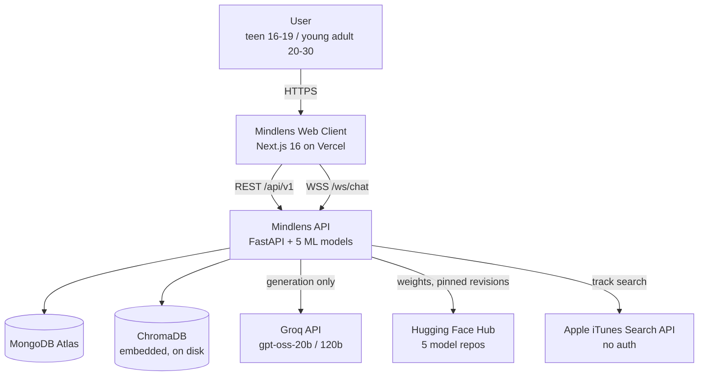

### D2 — Container / component view

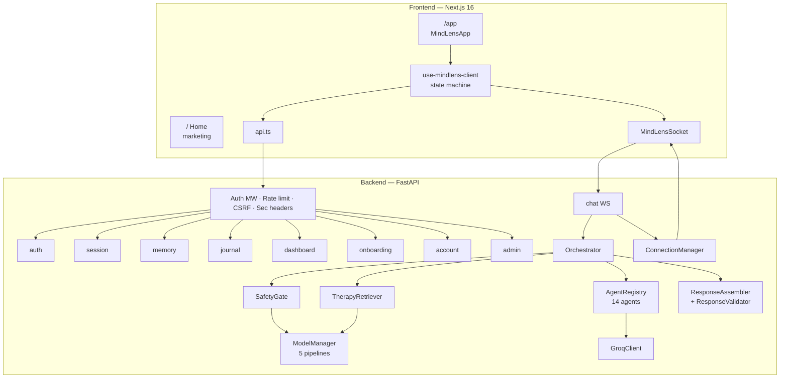

### D3 — The turn pipeline as a state graph

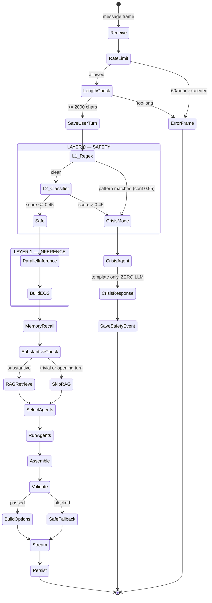

### D4 — Parallel model inference

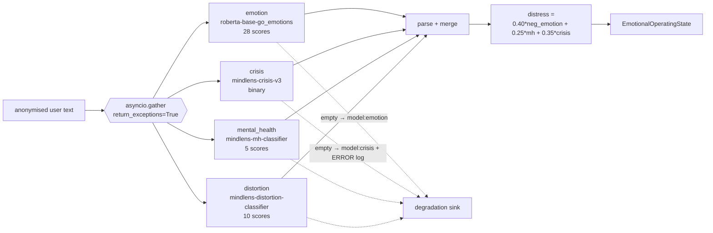

### D5 — Agent selection decision tree

```mermaid
graph TD
    S["EOS built"] --> C{"crisis_flag?"}
    C -->|yes| CR["agents = [crisis]<br/>STOP"]
    C -->|no| BASE["agents = [empathy]"]
    BASE --> HB{"held_back?<br/>opening_turn OR not substantive"}

    HB -->|yes| BK
    HB -->|no| G1{"distress > 0.5<br/>OR core in anxiety/fear/nervousness"}
    G1 -->|yes| A1["+ mindfulness"] --> G2
    G1 -->|no| G2{"distress > 0.4<br/>OR receptive to music"}
    G2 -->|yes| A2["+ music"] --> G3
    G2 -->|no| G3{"session_depth >= 0.3"}
    G3 -->|yes| A3["+ reflection"] --> G4
    G3 -->|no| G4{"trust >= 0.6 AND<br/>stability >= 0.5 AND<br/>not in crisis"}
    G4 -->|yes| A4["+ challenge"] --> G5
    G4 -->|no| G5{"modality == CBT"}
    G5 -->|yes| A5["+ distortion"] --> G6
    G5 -->|no| G6{"mental_fatigue >= 0.7"}
    G6 -->|yes| A6["+ routine"] --> G7
    G6 -->|no| G7{"stability >= 0.3 AND<br/>fatigue < 0.8 AND<br/>receptive to journaling"}
    G7 -->|yes| A7["+ journaling"] --> BK
    G7 -->|no| BK

    BK["bookkeeping gates"] --> B1{"turn % 5 == 0"}
    B1 -->|yes| P1["+ progress"] --> B2
    B1 -->|no| B2{"turn > 2"}
    B2 -->|yes| P2["+ personality"] --> B3
    B2 -->|no| B3{"turn % 3 == 0"}
    B3 -->|yes| P3["+ checkin_scheduler"] --> FIN
    B3 -->|no| FIN["+ session_memory_save<br/>ALWAYS"]
```

### D6 — Chat turn sequence

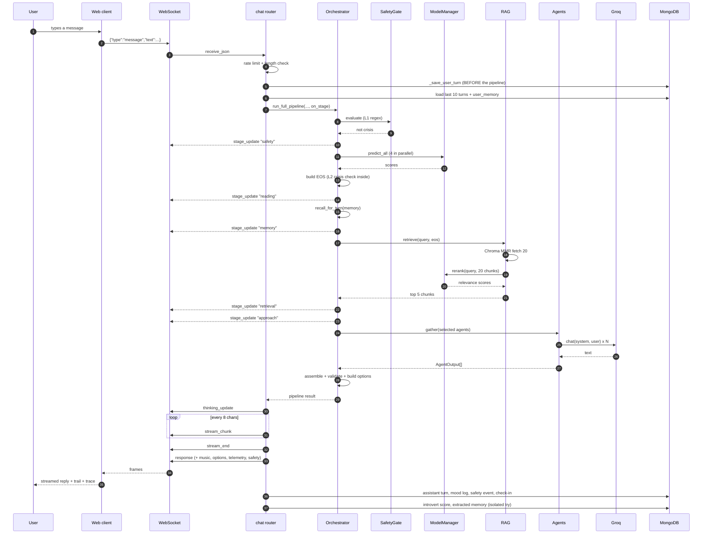

### D7 — Crisis path (the short graph, which is the point)

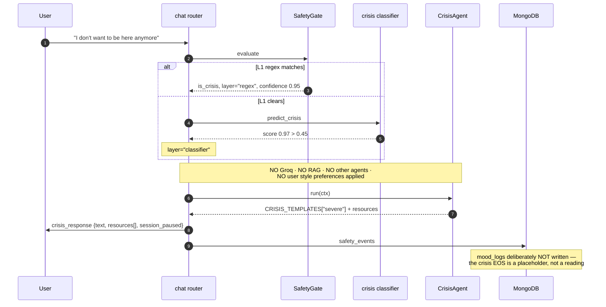

### D8 — RAG pipeline

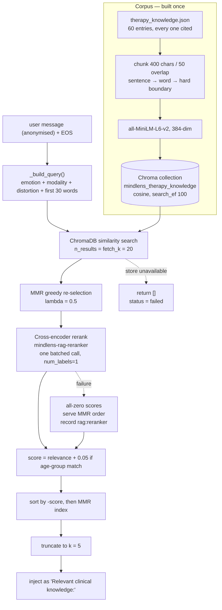

### D9 — Two-layer memory

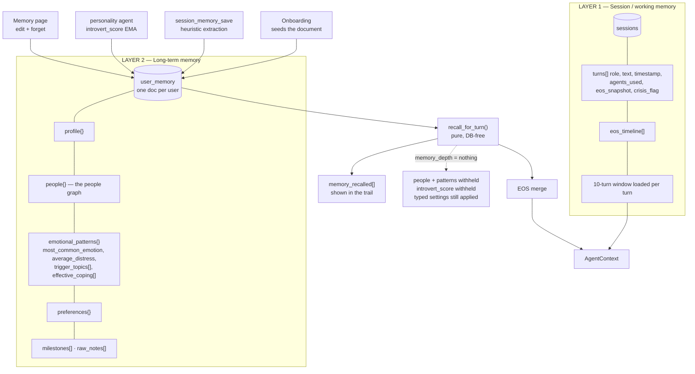

### D10 — Memory depth control

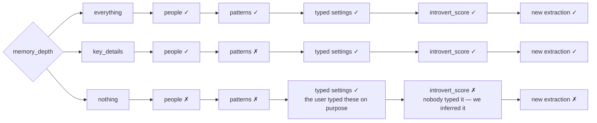

### D11 — Authentication flow

```mermaid
sequenceDiagram
    autonumber
    participant B as Browser
    participant A as auth router
    participant DB as MongoDB

    B->>A: POST /auth/login {email, password}
    A->>A: is_locked_out(email)? (5 fails / 15 min)
    A->>DB: find user by email
    A->>A: bcrypt.checkpw
    alt wrong
        A->>A: record_login_attempt
        A-->>B: 401
    else correct
        A->>A: reset_login_attempts
        A->>A: mint access (15 min) + refresh (7 days), HS256
        A->>DB: record device in user_sessions (jti + UA)
        A-->>B: Set-Cookie access_token (httpOnly)
        A-->>B: Set-Cookie refresh_token (httpOnly)
        A-->>B: Set-Cookie csrf_token (readable)
        A-->>B: body { access_token, csrf_token }
    end

    Note over B: writes send X-CSRF-Token; WS offers mindlens.jwt.<token>

    B->>A: POST /auth/refresh (cookie)
    A->>DB: check token_blocklist
    A->>DB: blocklist the old jti
    A-->>B: rotated pair
```

### D12 — Database entity relationships

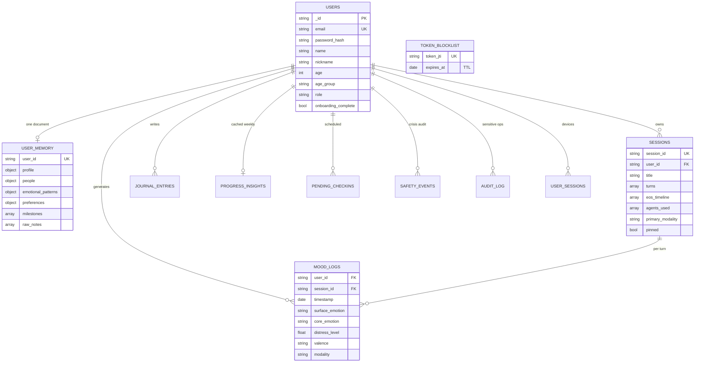

### D13 — Response assembly

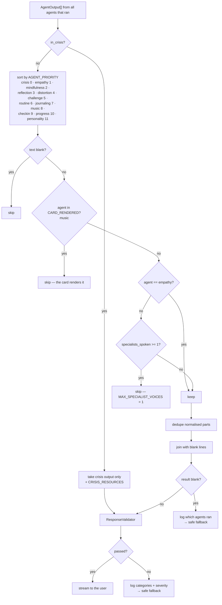

### D14 — Model training and publication pipeline

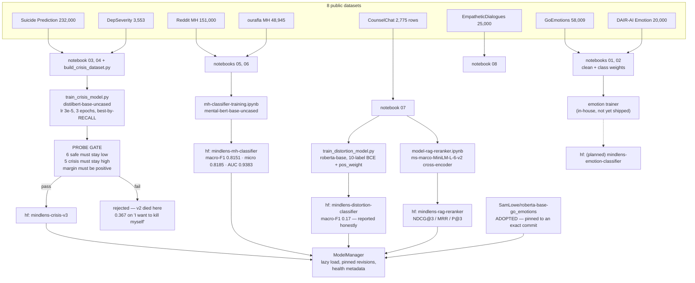

### D15 — The reranker's three-tier training data

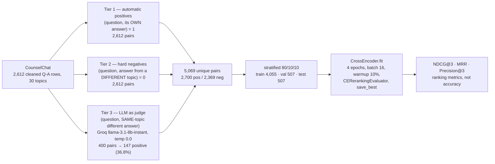

### D16 — Frontend component tree

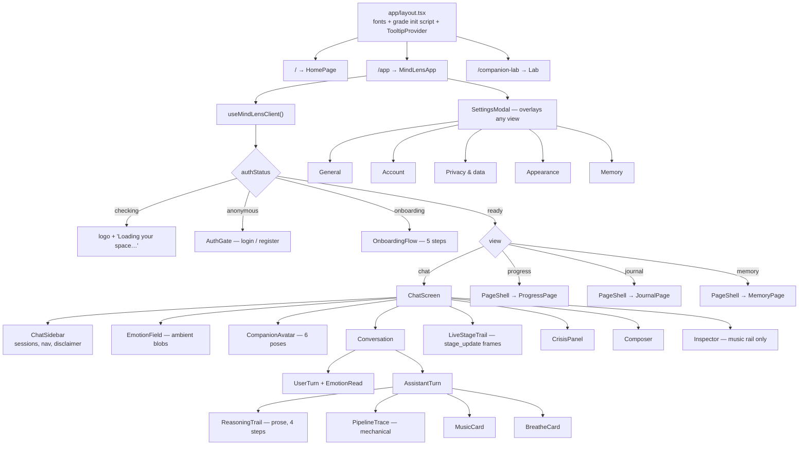

### D17 — Emotion folding, 28 → 12

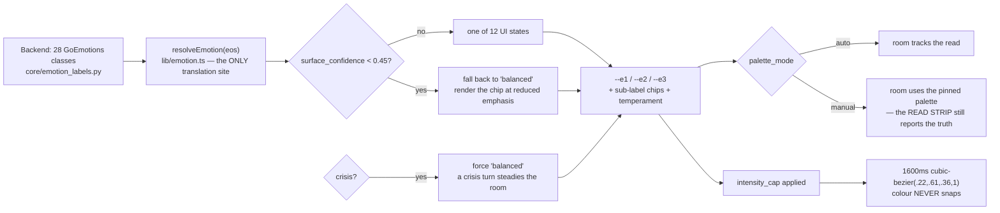

### D18 — Deployment topology

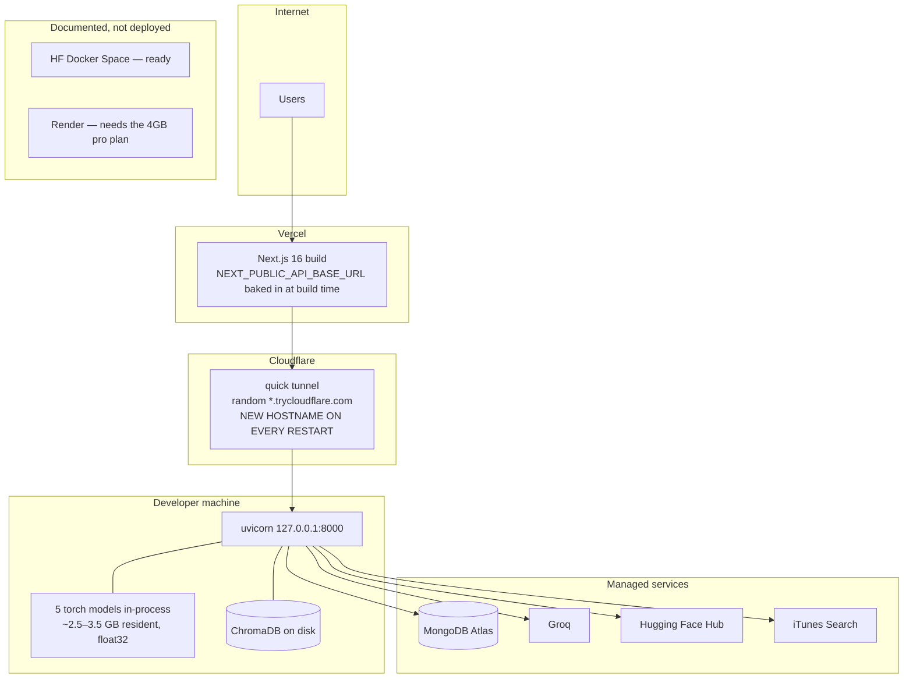

### D19 — Degradation and fallback map

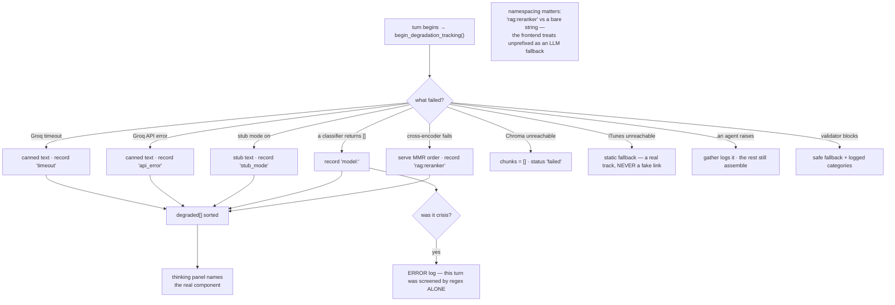

### D20 — The safety gate, in isolation

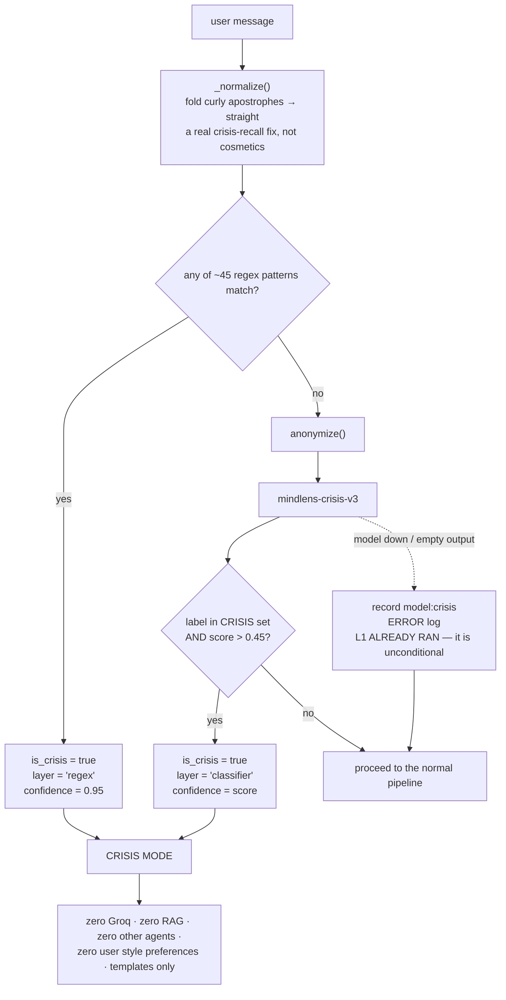

---

## 25. Repository map

```text
mindlens/
├── CLAUDE.md               the non-negotiable working rules
├── CHANGELOG.md            release history + known limitations
├── README.md               setup and verification commands
├── SECURITY.md             vulnerability reporting policy
├── CONTRIBUTING.md · CODE_OF_CONDUCT.md · LICENSE (MIT)
├── pyproject.toml          package metadata, ruff, mypy, pytest config
├── requirements.txt        pinned runtime deps
├── requirements-dev.txt    test + lint deps
├── render.yaml             documented alternative deploy (not used)
├── mypy.ini · .pre-commit-config.yaml
│
├── backend/
│   ├── Dockerfile
│   ├── run.py
│   ├── .env.example        every environment variable, documented
│   ├── data/
│   │   ├── therapy_knowledge.json    60 cited RAG entries
│   │   └── chroma_db/                the persistent vector store
│   ├── app/
│   │   ├── main.py         app factory, lifespan, /health, /ready
│   │   ├── config.py       pydantic-settings + production fail-closed
│   │   ├── db.py           Motor client, indexes, document_id_filter
│   │   ├── agents/         orchestrator + safety gate + 14 agents
│   │   │   ├── orchestrator.py          776 lines — the pipeline
│   │   │   ├── safety_gate.py           Layer 0
│   │   │   ├── crisis_agent.py          zero-LLM templates
│   │   │   ├── empathy_agent.py         the main voice
│   │   │   ├── mindfulness_agent.py · reflection_agent.py
│   │   │   ├── distortion_agent.py  · challenge_agent.py
│   │   │   ├── routine_agent.py     · journaling_agent.py
│   │   │   ├── music_agent.py           iTunes Search
│   │   │   ├── checkin_agent.py     · checkin_scheduler.py
│   │   │   ├── progress_agent.py    · personality_agent.py
│   │   │   ├── session_memory_save.py   the memory write path
│   │   │   ├── response_assembler.py · response_validator.py
│   │   │   ├── question_options.py  · streaming.py
│   │   │   ├── groq_client.py           tiers, timeouts, degradation
│   │   │   └── base_agent.py            AgentContext, AgentOutput, registry
│   │   ├── core/
│   │   │   ├── emotional_os.py          the EOS
│   │   │   ├── emotion_labels.py        28 classes + severity weights
│   │   │   ├── memory_recall.py         layer-2 read path (pure)
│   │   │   ├── anonymizer.py            PII stripping
│   │   │   └── connection_manager.py    WebSocket frames + heartbeat
│   │   ├── memory/session.py            turn buffer + session snapshots
│   │   ├── middleware/auth.py           JWT, rate limits, CSRF, request ID
│   │   ├── models/loader.py             the five-model registry
│   │   ├── rag/                         vector_store · ingest · retriever
│   │   ├── routers/                     auth · session · chat · memory ·
│   │   │                                journal · dashboard · onboarding ·
│   │   │                                account · system
│   │   └── utils/logger.py
│   └── tests/              730 tests, mirroring app/
│
├── frontend/
│   ├── package.json · next.config.ts · tsconfig.json · eslint.config.mjs
│   ├── .env.local.example
│   ├── public/             logo + icons
│   └── src/
│       ├── app/            layout · page (Home) · app/page · companion-lab
│       │                   globals.css (2,851 lines) · tokens.css (365)
│       │                   error · global-error · not-found
│       ├── components/
│       │   ├── home/                marketing page + reveal + magnetic
│       │   ├── chat/                12 chat components
│       │   ├── pages/               progress · journal · memory · shell
│       │   ├── settings/            5 wired sections + nav + use-prefs
│       │   ├── onboarding/          5-step flow
│       │   ├── companion/           avatar + family
│       │   ├── field/               emotion-field
│       │   ├── ai-elements/         Vercel AI Elements primitives
│       │   ├── ui/                  shadcn-style Radix primitives
│       │   ├── brand/wordmark.tsx
│       │   ├── auth-gate.tsx
│       │   └── mindlens-app.tsx     the state machine
│       └── lib/
│           ├── use-mindlens-client.ts   727 lines — client state
│           ├── api.ts                   typed REST wrappers
│           ├── websocket.ts             subprotocol auth + backoff
│           ├── types.ts                 mirrors the backend contract
│           ├── emotion.ts               28 → 12 folding + palettes
│           ├── reasoning.ts             the prose trail builder
│           ├── companions.ts            5 locked characters
│           ├── personalities.ts · preview.ts · utils.ts
│           └── use-grade.ts · use-read-aloud.ts · use-sidebar-collapsed.ts
│
├── notebooks/              00 master summary + 01–08 dataset cleaning
├── training/               crisis · distortion · emotion (×2) · mh · reranker
├── scripts/                build_crisis_dataset.py + 4 trainers + test_emotion
├── data/                   cleaned Arrow datasets · reports · figures
├── artifacts/              kaggle run logs · UI screenshots
├── docs/                   SYSTEM · DESIGN · API · DEPLOYMENT ·
│                           documentation (this file) · plans/
└── .github/workflows/ci.yml
```

### 25.1 Empty directories to clean up before submission

`models/` · `rag-ingest/` · `workers/` · `.agents/` · `spotify-mcp/` (only a
`__pycache__` remains after the Spotify integration was replaced).

---

## Appendix A — Quick reference for the report writer

**Numbers you can quote with confidence:**

| Figure | Value | Source |
|---|---|---|
| Backend tests | 730 | `pytest --collect-only` |
| Commits | 180 | `git rev-list --count HEAD` |
| Agents registered | 14 | `orchestrator._init_registry` |
| Models | 5 (1 adopted, 4 fine-tuned) | `config.py`, `loader.py` |
| Datasets | 8 public, 539,437 raw → 377,423 cleaned | `notebooks/00` |
| RAG corpus | 60 cited entries → ~67 chunks | `therapy_knowledge.json` |
| MH classifier | macro-F1 **0.8151** · micro-F1 **0.8185** · AUC **0.9383** | `mh-classifier-training.ipynb` output |
| Crisis v3 | 0/6 false positives · 5/5 caught · margin **+0.998** | `SYSTEM.md` §8.1.1 |
| Crisis v1 | 2/15 false positives · margin +0.06 | `SYSTEM.md` §8.1.1 |
| Distortion | macro-F1 **0.17** on ~690 weak labels | `CHANGELOG.md` |
| Reranker data | 5,069 pairs · 400 LLM-judged · 36.8 % positive | `model-rag-reranker.ipynb` output |
| GoEmotions imbalance | **172.17×** | `go_emotions_cleaned_report.json` |
| DAIR-AI imbalance | **9.37×** | `dair_emotion_cleaned_report.json` |
| Crisis threshold | **0.45** | `orchestrator.py`, `SYSTEM.md` §8.3 |
| Distress weights | 0.40 emotion / 0.25 MH / 0.35 crisis | `_compute_distress` |
| RAG k / fetch_k / λ | 5 / 20 / 0.5 | `config.py` |
| Emotion transition | 1600 ms | `DESIGN.md` §2.4 |
| Memory resident | ~2.5–3.5 GB | `CHANGELOG.md`, `render.yaml` |

**Numbers you must NOT quote until they are re-measured:**

- RAG reranker NDCG@3, MRR, Precision@3 (computed but not saved).
- In-house emotion classifier micro-F1 / macro-F1 and the baseline
  comparison table (notebook has no saved run).
- Crisis v3 aggregate F1 / accuracy on the held-out split (the probe results
  are what was recorded).

**The three strongest methodological contributions to lead with:**

1. **The crisis train/serve mismatch investigation** (§5.6) — a shipped model
   with good aggregate F1 that failed in production, three named root causes,
   a rejected intermediate fix, and a measured resolution. Aggregate F1
   concealed all of it because the test split came from the training
   distribution.
2. **The three-tier reranker dataset with LLM-as-judge** (§8.3) — a citable
   technique (Zheng et al., 2023) applied to a genuinely low-resource ranking
   task, with the real positive ratio reported.
3. **Building the honesty constraints into the code** (§11.6, §12.9, §19.8,
   §19.10) — the reasoning trail, the telemetry contract, the degradation
   sink, and the deleted controls are all instances of one rule: the
   interface may not claim work the system did not do.
